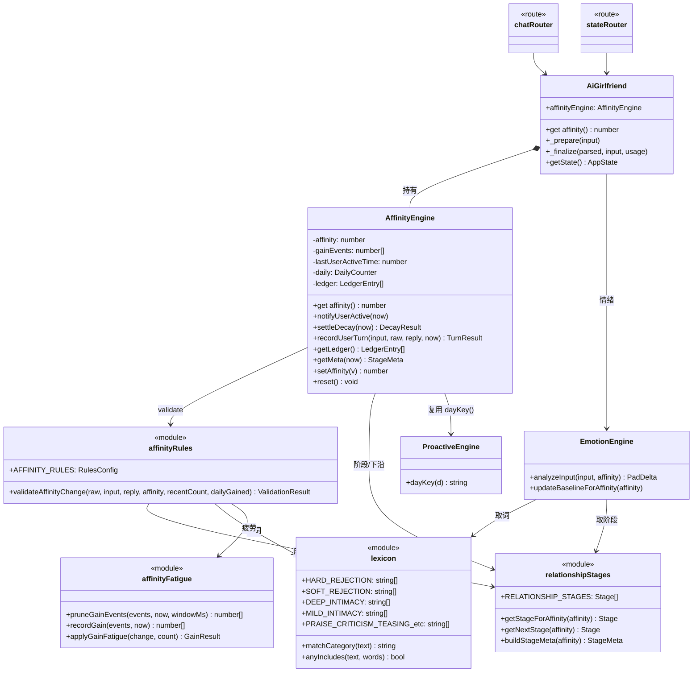
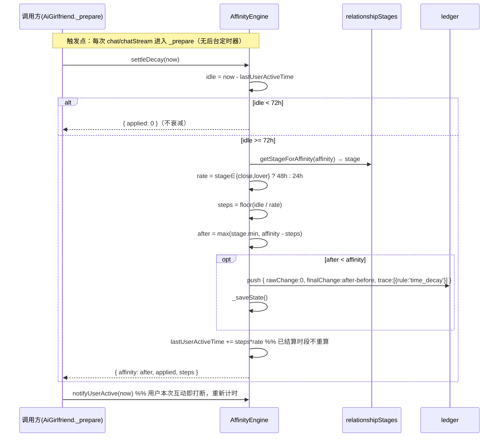

# 系统架构设计：小爱好感度系统重构与行为优化

- **Language**：简体中文
- **范围**：PRD 的 **P0-a / P0-b / P0-c / P0-d + P1-a / P1-b / P1-c / P1-d**（共 8 项）。**不含 P2**，不为 P2 预留任何接口/抽象。
- **前置约定**：允许重置 `data/state.json`，**不写任何旧字段兼容/迁移逻辑**。
- **对应 PRD**：`docs/affinity-refactor/01-PRD.md`
- **架构师**：高见远（Gao）

---

## 1. 实现方案总览

本次改造把好感度从「`AiGirlfriend` 编排器里散落的 `this.affinity` + 内联疲劳逻辑」重构成一个 **自持状态的引擎 `AffinityEngine`**，与既有 `ProactiveEngine` **完全对称**：它自己拥有并落盘 `affinity` / 24h 增益事件时间戳 / 变更账本 / 最后互动时间 / 当日累计涨分，落独立文件 `data/affinity_state.json`。

一次性解决 PRD 五个缺陷：**P0-a** 所有按阶段判断的逻辑改为 `getStageForAffinity(affinity).stage`，非阶段参数（超低保护 10、惯性系数、单次上下限、日上限、越界分档）全部集中到 `affinityRules.js` 顶部具名对象 `AFFINITY_RULES`；**P0-b** 新建唯一词表 `core/lexicon.js`，`affinityRules.js` 与 `EmotionEngine.analyzeInput()` 都改为 import，冲突词按 PRD 归位；**P0-c** 疲劳的裁窗/计数/push 抽成纯模块 `core/affinityFatigue.js`；**P0-d** `validateAffinityChange()` 返回值升级为 `{ change, trace }` 并新增 200 条上限的变更账本，chat/chatStream 响应带 `affinityTrace`，新增 `GET /affinity/ledger`；**P1-a** 时间衰减惰性结算、不新增定时器，在 `_prepare()` 里凭 `now - lastUserActiveTime` 推算；**P1-b** 日上限 +8 最后生效、截断处理；**P1-c** 越界/惯性改为按阶段名挂参数表。

**改造后的数据流**（一段话）：用户发消息 → `routes/chat.js` 调 `proactiveEngine.notifyUserActive()` → `AiGirlfriend._prepare()` **先** `affinityEngine.settleDecay(now)`（按久未互动惰性扣分并写账本 `time_decay`）、**再** `affinityEngine.notifyUserActive(now)` 刷新互动时间 → 组装 prompt 调 LLM → `_finalize()` 调 `affinityEngine.recordUserTurn(userInput, rawChange, replyText, now)`，引擎内部完成「24h 裁窗计数 → 当日额度读取 → `validateAffinityChange()` 逐规则修正并生成 `trace` → 更新 affinity/增益事件/当日涨分 → 追加账本(≤200) → 存盘」→ 返回 `{ affinity, change, trace, meta }`，路由把 `affinityTrace` 与阶段元数据（`stage/stageLabel/stageShortLabel/nextStage/pointsToNextStage/stageProgress`）平铺进响应；前端 `chatStore` 消费后由 `CharacterPanel` 零阈值渲染阶段标签、距下一阶段点数与「最近一次变化原因」。

---

## 2. 文件列表

> 路径均相对项目根 `D:/AI-Projects/ai-girlfriend`。

### 2.1 新增

| 文件 | 一句话职责 |
|---|---|
| `backend-node/src/core/lexicon.js` | **唯一词表**：好感度四类词（硬拒绝/软拒绝/重度亲密/轻度亲密）+ 7 类情绪向词（PRAISE/CRITICISM/TEASING/EXCITING/CALMING/SAD/QUESTION），并提供 `matchCategory()` 与 `anyIncludes()`。 |
| `backend-node/src/core/affinityFatigue.js` | **加分疲劳纯函数模块**：`pruneGainEvents()` / `applyGainFatigue()` / `recordGain()`，无副作用、可独立测试。 |
| `backend-node/src/core/AffinityEngine.js` | **好感度引擎**：自持并落盘 `affinity` / 增益事件 / 账本 / 最后互动时间 / 当日涨分；对外 `recordUserTurn()` / `settleDecay()` / `notifyUserActive()` / `getLedger()` / `getMeta()` / `setAffinity()` / `reset()`。 |
| `backend-node/scripts/test-affinity.mjs` | **好感度规则回归测试**（单进程自包含、不 spawn 子进程），被 `npm test` 串起。 |
| `frontend/src/components/character/StageProgress.tsx` | 展示「阶段标签 + 距下一阶段还差 N 点 + 本阶段进度条」，固定高度、零阈值。 |
| `frontend/src/components/character/AffinityReason.tsx` | 展示「最近一次变化原因」一句话 + 变化数字着色 + 衰减/日上限提示，固定高度。 |

### 2.2 修改

| 文件 | 一句话职责（改动点） |
|---|---|
| `backend-node/src/core/relationshipStages.js` | 仍是阶段阈值唯一事实源；**新增** `getStageIndex()` / `getNextStage()` / `buildStageMeta(affinity)`（下发阶段元数据），阈值数组不动。 |
| `backend-node/src/core/affinityRules.js` | 删除硬编码 35/60 与 70/80/90、删除本地 4 张词表；**新增顶部 `AFFINITY_RULES` 具名配置**；`validateAffinityChange()` 改为按阶段名判断 + 返回 `{ change, trace }`。 |
| `backend-node/src/core/EmotionEngine.js` | `analyzeInput()` 改用 `lexicon` 词表 + `getStageForAffinity().stage` 分支；删除本地 8 张词表与 15/34/59/84。 |
| `backend-node/src/core/AiGirlfriend.js` | 删除 `this.affinity` / `this.recentGainEvents`，改持 `this.affinityEngine`；新增 `get affinity()` 兼容 getter；`_prepare()` 加惰性结算+打卡；`_finalize()` 改调引擎；`getState()` / `updateState()` / `clearHistory()` 改走引擎；`_saveState()` schema 去掉 affinity/recentGainEvents。 |
| `backend-node/src/core/ProactiveEngine.js` | **仅**把模块私有 `dayKey()` 加上 `export`（供 `AffinityEngine` 复用同一「本地自然日」口径），其余不动。 |
| `backend-node/src/routes/chat.js` | `/chat` 与 `/chat/stream` 响应平铺 `affinityTrace` 与阶段元数据字段。 |
| `backend-node/src/routes/state.js` | `GET /state` 自动带上阶段元数据（来自 `getState()`）；**新增** `GET /affinity/ledger`（挂根路径，无 `/api` 前缀）。 |
| `backend-node/package.json` | `test` 脚本串联两个测试文件。 |
| `frontend/src/types/index.ts` | 新增 `AffinityStageMeta` / `AffinityTraceEntry`；扩展 `AppState` 与 `ChatResponse`。 |
| `frontend/src/stores/chatStore.ts` | 新增 `stageMeta` / `affinityTrace` / `recentReason` 等 state，`applyMeta`/`syncState` 消费后端字段。 |
| `frontend/src/components/character/CharacterPanel.tsx` | **删除** `getAffinityTitle()` 的 16/35/60/85 镜像，改消费 store 的 `stageLabel`；挂载 `StageProgress` 与 `AffinityReason`。 |
| `frontend/src/lib/api.ts` | 新增 `getAffinityLedger()`（读 `/affinity/ledger`）。 |

### 2.3 删除

| 文件 | 原因 |
|---|---|
| `backend-node/scripts/verify-affinity.mjs` | 一次性脚本被 `scripts/test-affinity.mjs` 收编，避免「两份事实」（PRD P1-d 验收 3）。 |

> 说明：路由文件总数 6→6（`/affinity/ledger` 并入 `state.js`，不新增路由文件），`src/**/*.js` 由 26 → **29**（新增 `lexicon.js` / `affinityFatigue.js` / `AffinityEngine.js`），与 `npm run check` 预期一致。

### 2.4 不改动

- `backend-node/src/app.js`：`state.js` 已挂载在根路径，无需改。
- `frontend/src/components/character/AffinityHearts.tsx`：纯视觉，保留。
- `frontend/src/hooks/useChatStream.ts`：`settle()` 已把整个 `ChatResponse` 透传给 `applyMeta`，新增字段自动流过，无需改。

---

## 3. 数据结构与接口

### 3.1 `core/relationshipStages.js`（新增导出的函数签名）

```js
export const RELATIONSHIP_STAGES = [ /* 阈值数组不变 15/34/59/84 */ ];

/** 0-100 → 阶段条目 { min,max,stage,label,shortLabel }；越界 clamp */
export function getStageForAffinity(affinity): Stage;

/** 阶段在数组中的下标（0-4），未知返回 0 */
export function getStageIndex(affinity): number;

/** 下一阶段条目；已是 lover 返回 null */
export function getNextStage(affinity): Stage | null;

/**
 * 下发给前端的阶段元数据（前端零阈值）。
 * stageProgress = (affinity - stage.min) / (stage.max - stage.min)，clamp [0,1]
 * pointsToNextStage = max(0, next.min - affinity)；lover 阶段为 0
 */
export function buildStageMeta(affinity): {
  stage: string,                 // 'friend'
  stageLabel: string,            // '朋友'（label）
  stageShortLabel: string,       // '朋友'（shortLabel）
  nextStage: string | null,      // 'close' | null
  nextStageLabel: string | null, // '挚友/暧昧' | null
  pointsToNextStage: number,     // 距下一阶段还差几点
  stageProgress: number,         // 当前阶段内 0-1 进度
};
```

### 3.2 `core/lexicon.js`（唯一词表）

```js
// 互斥原则（PRD P0-b）：命中即归类，优先级 HARD > SOFT > DEEP > MILD > PRAISE > CRITICISM > TEASING
export const HARD_REJECTION = ['不太合适','刚认识','陌生','不熟','保持距离','后退',
  '请不要这样','别这样','这样不好','我们还不熟','太突然了'];
export const SOFT_REJECTION = ['讨厌','哼','走开','不理你','不跟你说了','烦人',
  '坏人','大坏蛋','过分','欺负','坏蛋','不理你了','哼唧'];
export const DEEP_INTIMACY  = ['爱你','亲亲','抱抱','么么','老婆','老公','宝贝','亲爱的'];
export const MILD_INTIMACY  = ['喜欢你','想你','喜欢你呀','想你了'];

// 情绪向词表（与上四类互斥：无 exact-token 交集）
export const PRAISE    = ['好棒','厉害','可爱','漂亮','聪明','温柔','最喜欢','真好','谢谢','感谢'];
export const CRITICISM = ['烦','丑','恶心','别烦我','无语'];              // 移出「讨厌」「走开」→ SOFT
export const TEASING   = ['笨蛋','傻瓜','猪头','小傻瓜','大笨蛋','呆子'];   // 移出「哼」→ SOFT
export const EXCITING  = ['惊喜','太棒了','哇','好激动','天啊','啊啊','居然','没想到'];
export const CALMING   = ['晚安','休息','慢慢','别急','放松','累了','困了'];
export const SAD       = ['难过','伤心','哭','不开心','失望','孤独','寂寞','想哭'];
export const QUESTION  = ['?','？','怎么','为什么','什么','谁','哪里','什么时候'];

export const RELATIONSHIP_LEXICON = [                              // 按优先级排列
  ['HARD_REJECTION', HARD_REJECTION],
  ['SOFT_REJECTION', SOFT_REJECTION],
  ['DEEP_INTIMACY', DEEP_INTIMACY],
  ['MILD_INTIMACY', MILD_INTIMACY],
  ['PRAISE', PRAISE], ['CRITICISM', CRITICISM], ['TEASING', TEASING],
];

export function anyIncludes(text, words): boolean;                  // text.includes 任一
/**
 * 返回 text 命中的最高优先级主分类名，未命中返回 null。
 * 用于「同一句话在好感度判定与情绪分析里返回同一分类」。
 */
export function matchCategory(text): string | null;
```

> 冲突修正落地：`抱抱/亲亲` 两边都 → `DEEP_INTIMACY`；`讨厌/哼` → `SOFT_REJECTION`（不再算 CRITICISM/TEASING）；`喜欢你` → `MILD_INTIMACY`。

### 3.3 `core/affinityRules.js`（配置对象 + 校验函数）

```js
import { getStageForAffinity, RELATIONSHIP_STAGES } from './relationshipStages.js';
import { anyIncludes, matchCategory, DEEP_INTIMACY, MILD_INTIMACY,
         HARD_REJECTION, SOFT_REJECTION } from './lexicon.js';
import { applyGainFatigue } from './affinityFatigue.js';

export const AFFINITY_RULES = {
  // —— 单次变化边界（非阶段边界，集中具名）——
  MAX_POSITIVE_PER_TURN: 3,    // 正向单次最多 +3：好感缓慢积累
  MAX_NEGATIVE_PER_TURN: -10,  // 负向单次最多 -10：一次伤害可以很大

  // —— 超低好感保护（非阶段边界；心灰意冷时一两句好话挽回有限）——
  ULTRA_LOW_AFFINITY: 10,
  ULTRA_LOW_POSITIVE_MULTIPLIER: 0.3,

  // —— 每日正增长上限（自然日 00:00 重置；必须最后生效）——
  DAILY_POSITIVE_CAP: 8,

  // —— 越界惩罚：按 stage 名挂参数（阈值由 relationshipStages 决定）——
  OVERREACH_PENALTY: {
    stranger:     { mild: -2, deep: -3 },
    acquaintance: { mild: -2, deep: -3 },
    friend:       { mild:  0, deep: -2 },
    close:        { mild:  0, deep:  0 },
    lover:        { mild:  0, deep:  0 },
  },

  // —— 负向惯性：按 stage 名挂参数（深爱难以骤降；取消 70/80/90）——
  NEGATIVE_INERTIA: {
    stranger: 1.0, acquaintance: 1.0, friend: 1.0, close: 0.5, lover: 0.2,
  },

  // —— 硬拒绝后仍强行亲密的追加惩罚 ——
  HARD_REJECTION_FORCED_INTIMACY_PENALTY: -2,
};

/** 一条 trace 修正记录 */
// TraceEntry = { rule: string, from: number, to: number, reason: string }

/**
 * 纯函数：不读文件、不读时间、不读全局状态。
 * @param rawChange         LLM 给的原始变化
 * @param userInput         用户消息（判越界/亲密）
 * @param aiReply           AI 回复（判硬/软拒绝）
 * @param affinity          当前好感度（0-100；阶段由它派生）
 * @param recentPositiveCount 近 24h 已生效正增长次数（调用方注入）
 * @param dailyGainedToday  今日已累计正增长（调用方注入）
 * @returns { change: number, trace: TraceEntry[] }
 *
 * 不变量：rawChange + Σ(trace[i].to - trace[i].from) === change
 * 规则顺序：单次上限 → 硬拒绝 → 软拒绝/傲娇 → 越界 → 疲劳 → 超低保护 → 负向惯性 → 日上限(最后)
 */
export function validateAffinityChange(
  rawChange, userInput, aiReply, affinity,
  recentPositiveCount = 0, dailyGainedToday = 0
): { change: number, trace: TraceEntry[] };
```

**逐规则伪代码（工程师据此实现，rule 名固定）**：

```js
const R = AFFINITY_RULES;
const stage = getStageForAffinity(affinity).stage;
let cur = rawChange;
const trace = [];
const rule = (name, next, reason) => {                    // 只在真的变了时记录
  if (next !== cur) { trace.push({ rule: name, from: cur, to: next, reason }); cur = next; }
};

// 0 单次上限
rule('single_turn_clamp',
     Math.max(R.MAX_NEGATIVE_PER_TURN, Math.min(R.MAX_POSITIVE_PER_TURN, cur)),
     `单次变化收敛到 ${R.MAX_NEGATIVE_PER_TURN}~+${R.MAX_POSITIVE_PER_TURN}`);

const hasHard = anyIncludes(aiReply, HARD_REJECTION);
const hasSoft = anyIncludes(aiReply, SOFT_REJECTION);
const deep    = anyIncludes(userInput, DEEP_INTIMACY);
const mild    = !deep && anyIncludes(userInput, MILD_INTIMACY);
const intimacy = deep || mild;

// 1 硬拒绝
if (hasHard) {
  rule('hard_rejection', Math.min(0, cur), '她明确拒绝了，好感度不会因此上涨');
  if (intimacy)
    rule('forced_intimacy_penalty', Math.min(cur, R.HARD_REJECTION_FORCED_INTIMACY_PENALTY),
         '她明确拒绝后还强行亲密，扣分');
}
// 2 软拒绝/傲娇
if (hasSoft) {
  if ((stage === 'close' || stage === 'lover') && intimacy) {
    rule('tsundere_play', Math.max(cur, 0), '她只是傲娇，不阻断也不扣分');
  } else {
    rule('soft_rejection', Math.min(0, cur), '她在软拒绝，好感度不会上涨');
  }
}
// 3 越界惩罚
if (intimacy && !hasHard) {
  const pen = R.OVERREACH_PENALTY[stage];
  const floor = deep ? pen.deep : pen.mild;
  if (floor < 0)
    rule('overreach_penalty', Math.min(cur, floor),
         deep ? '恋人式言行，关系还没到那一步，想后退'
              : '这么快说亲密的话，她有点别扭');
}
// 4 加分疲劳（复用纯模块；仅正变化）
if (cur > 0 && recentPositiveCount > 0) {
  const { change: next } = applyGainFatigue(cur, recentPositiveCount);
  rule('gain_fatigue', next, `24 小时内已经涨过 ${recentPositiveCount} 次，这次涨幅收窄`);
}
// 5 超低好感保护
if (affinity < R.ULTRA_LOW_AFFINITY && cur > 0) {
  rule('ultra_low_protection', Math.round(cur * R.ULTRA_LOW_POSITIVE_MULTIPLIER),
       '她心灰意冷，一两句好话挽回有限');
}
// 6 负向惯性
if (cur < 0) {
  rule('negative_inertia', Math.round(cur * R.NEGATIVE_INERTIA[stage]),
       `关系已到「${stage}」，负面变化被惯性削弱`);
}
// 7 日上限（最后生效，反映「今天还剩多少额度」）
if (cur > 0) {
  const remaining = Math.max(0, R.DAILY_POSITIVE_CAP - dailyGainedToday);
  rule('daily_cap', Math.min(cur, remaining), `今天的好感额度只剩 ${remaining} 点`);
}
return { change: cur, trace };
```

### 3.4 `core/affinityFatigue.js`（纯函数）

```js
/** 裁掉 windowMs 之前的事件，返回新数组（不改入参） */
export function pruneGainEvents(events: number[], now: number, windowMs: number): number[];

/** 追加一个时间戳，返回新数组 */
export function recordGain(events: number[], now: number): number[];

/**
 * 24h 疲劳：count>=3 → 0；count 1~2 → Math.round(change*0.5)；count 0 → 原值
 * @returns { change: number, applied: boolean }
 */
export function applyGainFatigue(change: number, recentPositiveCount: number): { change: number, applied: boolean };
```

### 3.5 `core/AffinityEngine.js`（自持状态引擎）

**常量（文件顶部，具名可微调）**：

```js
const STATE_FILE = 'affinity_state.json';   // 构造参数可覆盖（测试用）
const GAIN_WINDOW_MS = 24 * 60 * 60 * 1000;
const LEDGER_MAX = 200;
const DECAY = {
  START_MS:      72 * 60 * 60 * 1000,   // 满 72h 未互动启动
  RATE_MS_LOW:   24 * 60 * 60 * 1000,   // stranger/acquaintance/friend：每 24h -1
  RATE_MS_HIGH:  48 * 60 * 60 * 1000,   // close/lover：每 48h -1
  HIGH_STAGES:   ['close', 'lover'],
};
```

**落盘 schema `data/affinity_state.json`**：

```jsonc
{
  "affinity": 35,                              // 0-100 整数
  "gainEvents": [1712345678901],               // 近 24h 正增长时间戳（epoch ms）
  "lastUserActiveTime": 1712345678901,         // 最后一次用户消息时间（epoch ms）
  "daily": { "dayKey": "2026-09-29", "gained": 0 },  // 本地自然日累计正增长
  "ledger": [                                  // 变更账本，最多 200 条，最旧先丢
    {
      "at": "2026-09-29T05:12:43.886Z",        // ISO 8601 (UTC)
      "before": 35, "after": 37,
      "rawChange": 2, "finalChange": 2,
      "stage": "friend",
      "userInputDigest": "老婆晚上好",          // 用户消息前 40 字符；衰减时为 null
      "trace": [ { "rule": "overreach_penalty", "from": 2, "to": -2, "reason": "…" } ]
    }
  ],
  "lastUpdated": "2026-09-29T05:12:43.886Z"
}
```

**类接口**：

```js
class AffinityEngine {
  constructor(stateFileName = 'affinity_state.json');

  get affinity(): number;                       // 读
  setAffinity(value: number): number;           // 手动覆盖（updateState 用），clamp 0-100 后存盘

  /**
   * 用户发消息时刷新「最后互动时间」为 now。
   * ⚠️ 必须在 settleDecay(now) 之后调用，否则会把待结算的空闲时间抹掉。
   */
  notifyUserActive(now = Date.now()): void;

  /**
   * 惰性时间衰减（不新增定时器）：
   *   idle = now - lastUserActiveTime
   *   if (idle < DECAY.START_MS) 直接返回 { applied: 0 }
   *   stage = getStageForAffinity(affinity)
   *   rate  = HIGH_STAGES 含 stage ? RATE_MS_HIGH : RATE_MS_LOW
   *   steps = floor(idle / rate)
   *   after = max(stage.min, affinity - steps)          // 止损于当前阶段下沿
   *   consumed = steps * rate ; lastUserActiveTime += consumed   // 已结算时段不重算
   *   if (after < affinity) 写账本(trace: time_decay, rawChange=0) 并存盘
   * @returns { affinity, applied, steps }
   */
  settleDecay(now = Date.now()): { affinity: number, applied: number, steps: number };

  /**
   * 一次用户回合的好感度结算（唯一写入点）：
   *   1 pruneGainEvents(gainEvents, now, GAIN_WINDOW_MS) → recentPositiveCount = length
   *   2 _rollDayIfNeeded(now) → dailyGainedToday = daily.gained
   *   3 { change, trace } = validateAffinityChange(rawChange, userInput, aiReply, affinity,
   *                                                recentPositiveCount, dailyGainedToday)
   *   4 before = affinity ; affinity = clamp(0,100, before + change)
   *   5 change>0 → recordGain ; daily.gained += change
   *   6 追加账本(before/after/rawChange/finalChange/stage/userInputDigest/trace)；裁剪至 LEDGER_MAX；存盘
   * @returns { affinity, change, trace, meta }
   */
  recordUserTurn(userInput, rawChange, aiReply, now = Date.now()):
    { affinity, change, trace, meta };

  getLedger(): LedgerEntry[];                    // 按时间升序返回（≤200）
  getMeta(now = Date.now()): {                   // 下发前端的阶段元数据 + 提示
    stage, stageLabel, stageShortLabel, nextStage, nextStageLabel,
    pointsToNextStage, stageProgress,
    recentChangeReason: string | null,           // 账本最后一条 trace 最后一项的 reason
    decaying: boolean,                           // now-lastUserActiveTime>=START 且 affinity>stage.min
    dailyCapReached: boolean,                    // daily.gained >= AFFINITY_RULES.DAILY_POSITIVE_CAP
  };
  reset(): { affinity: number };                 // 回 35、清空事件/账本/当日；clearHistory 用
}
```

> **账本不变量**：`rawChange + Σ(trace[i].to - trace[i].from) === finalChange`。衰减条目取 `rawChange = 0`、`trace = [{rule:'time_decay', from:0, to: finalChange, reason}]`，同样满足。`finalChange` 为 `validateAffinityChange()` 的输出；因 `after` 会做 0/100 绝对夹取，边界处 `after` 可能 ≠ `before + finalChange`（测试断言只在 (0,100) 内进行）。

**衰减公式口径（务必按此实现，测试据此断言）**：

| 场景 | 计算 | 结果 |
|---|---|---|
| friend(40) 静默 71h | idle<72h → 不衰减 | 40 |
| friend(40) 静默 72h | floor(72/24)=3 → 40-3 | 37 |
| friend(40) 静默 120h(5天) | floor(120/24)=5 → 40-5=35（=阶段下沿，止跌） | 35 |
| close(70) 静默 72h | floor(72/48)=1 → 70-1 | 69 |
| close(70) 静默 120h(5天) | floor(120/48)=2 | 68 |
| 任意阶段静默 30 天 | 每天约 -1（低阶段 30 点；高级阶段更少） | 阶段下沿 |

> 结算采用 **消耗式**：`lastUserActiveTime += steps*rate`，使已结算的整段空闲不会在下次调用时被重复扣分。

### 3.6 `core/AiGirlfriend.js`（改动后的关键签名）

```js
// 构造：this.affinityEngine = new AffinityEngine();  // 删除 this.affinity / this.recentGainEvents

get affinity() { return this.affinityEngine.affinity; }   // 兼容 ProactiveEngine 等处对 .affinity 的读取

async _prepare(userInput) {
  const now = Date.now();
  this.affinityEngine.settleDecay(now);        // ① 先结算衰减
  this.affinityEngine.notifyUserActive(now);   // ② 再打卡
  // …原 ghost 判定 / updateBaselineForAffinity(this.affinity) / 记忆检索 / 组装 prompt…
}

_finalize(parsed, userInput, usage) {
  // …情绪链路不变…
  const { affinity, change, trace, meta } =
    this.affinityEngine.recordUserTurn(userInput, parsed.affinityChange, parsed.replyText);
  // …personalityDrift / history 写入不变…
  return {
    reply: parsed.replyText, token_usage: usage || {},
    emotion: this.emotionEngine.getEmotionLabel(),
    affinity, affinityTrace: trace, affinityMeta: meta,
    emotionalState: this.emotionEngine.getFullState(),
    innerThought: parsed.innerThought, modelReasoning: parsed.modelReasoning,
  };
}

getState() {                                    // /state 响应
  return {
    affinity: this.affinity,
    nickname: this.nickname || '亲爱的',
    historyCount: …, memoryCount: …,
    emotionalState: …,
    ...this.affinityEngine.getMeta(),           // 平铺阶段元数据 + recentChangeReason/decaying/dailyCapReached
  };
}
updateState(updates) { if (typeof updates.affinity === 'number') this.affinityEngine.setAffinity(updates.affinity); … }
clearHistory()       { …; this.affinityEngine.reset(); … }
```

### 3.7 API 契约

| 方法 | 路径 | 请求 | 响应（新增字段加粗） |
|---|---|---|---|
| POST | `/chat` | `{ message }` | `{ reply, token_usage, context_count, emotion, affinity, **affinityTrace**, **stage/stageLabel/stageShortLabel/nextStage/nextStageLabel/pointsToNextStage/stageProgress**, **recentChangeReason**, **decaying**, **dailyCapReached**, emotionalState, inner_thought, model_reasoning }` |
| POST | `/chat/stream` | `{ message }`（SSE） | `{type:'done', …同上字段…}` |
| GET | `/state` | — | `{ affinity, nickname, historyCount, memoryCount, emotionalState, **阶段元数据/提示字段同上** }` |
| GET | `/affinity/ledger` | — | `LedgerEntry[]`（时间升序，≤200 条） |

**响应中阶段元数据字段（与 `buildStageMeta()` 输出逐字段一致）**：
`stage`(string) / `stageLabel`(string) / `stageShortLabel`(string) / `nextStage`(string\|null) / `nextStageLabel`(string\|null) / `pointsToNextStage`(number) / `stageProgress`(number 0-1)；另加 `recentChangeReason`(string\|null) / `decaying`(bool) / `dailyCapReached`(bool)。

> ⚠️ 路由一律挂根路径，**没有 `/api` 前缀**；PRD 里写的 `GET /api/affinity/history` 作废，改为 `GET /affinity/ledger`。

### 3.8 前端类型（`types/index.ts` 新增）

```ts
export interface AffinityStageMeta {
  stage: string; stageLabel: string; stageShortLabel: string;
  nextStage: string | null; nextStageLabel: string | null;
  pointsToNextStage: number; stageProgress: number;
}
export interface AffinityTraceEntry {
  rule: string; from: number; to: number; reason: string;
}
// AppState 扩展为：AffinityStageMeta & { recentChangeReason: string | null; decaying: boolean; dailyCapReached: boolean } & 既有字段
// ChatResponse 扩展为：& { affinityTrace?: AffinityTraceEntry[] } & AffinityStageMeta & 上述三个提示字段
```

### 3.9 类图



---

## 4. 程序调用流程

### 4.1 一次 chat 请求（进入 `_prepare` → 好感度落账）

```mermaid
sequenceDiagram
    participant FE as 前端 chatStore
    participant RT as routes/chat.js
    participant AG as AiGirlfriend
    participant AE as AffinityEngine
    participant LE as lexicon+affinityRules
    participant PE as ProactiveEngine
    participant LLM as LLM

    FE->>RT: POST /chat/stream {message}
    RT->>PE: notifyUserActive()
    RT->>AG: chatStream(message, onDelta)

    Note over AG,AE: _prepare() 开头，顺序不可颠倒
    AG->>AE: settleDecay(now)
    AE->>AE: idle = now - lastUserActiveTime
    alt idle >= 72h 且未到阶段下沿
        AE->>AE: steps = floor(idle/rate); after = max(stage.min, affinity-steps)
        AE->>AE: 写账本(rule=time_decay) + lastUserActiveTime += steps*rate
    end
    AE-->>AG: { affinity, applied }
    AG->>AE: notifyUserActive(now)   %% 刷新互动时间，开始新的 72h 计时

    AG->>AG: ghost 判定 / updateBaselineForAffinity(affinity) / 记忆检索 / 组装 prompt
    AG->>LLM: chat.completions.create(stream)
    loop 每个 delta
        LLM-->>AG: chunk
        AG-->>FE: SSE {type:'delta', text}
    end

    AG->>AG: _finalize(parsed)
    AG->>AE: recordUserTurn(userInput, rawChange=parsed.affinityChange, replyText, now)
    AE->>AE: pruneGainEvents(gainEvents, now, 24h) → recentPositiveCount
    AE->>AE: _rollDayIfNeeded(now) → dailyGainedToday
    AE->>LE: validateAffinityChange(raw, input, reply, affinity, recentCount, dailyGained)
    LE-->>AE: { change, trace }
    AE->>AE: affinity = clamp(0,100, before+change)
    AE->>AE: change>0 → recordGain + daily.gained += change
    AE->>AE: 追加账本(≤200) + _saveState()
    AE-->>AG: { affinity, change, trace, meta }
    AG-->>RT: result{ affinity, affinityTrace, affinityMeta, emotion, … }
    RT-->>FE: SSE {type:'done', affinity, affinityTrace, stage, stageLabel, pointsToNextStage, recentChangeReason, …}
    FE->>FE: applyMeta() 更新 store → CharacterPanel 重渲染
```

### 4.2 衰减的惰性结算时机



---

## 5. 任务列表（有序，工程师照此逐条实现）

### T01 — 后端规则内核（词典 + 规则 + 疲劳 + 阶段元数据）

- **目标文件**：
  - 新增 `backend-node/src/core/lexicon.js`
  - 新增 `backend-node/src/core/affinityFatigue.js`
  - 改 `backend-node/src/core/relationshipStages.js`（加 `getStageIndex/getNextStage/buildStageMeta`，阈值数组不动）
  - 重写 `backend-node/src/core/affinityRules.js`（`AFFINITY_RULES` + `{change,trace}`）
- **做什么**：按 §3.1–3.4 实现。`lexicon` 定义 11 张表 + `matchCategory`（优先级 HARD>SOFT>DEEP>MILD>PRAISE>CRITICISM>TEASING）+ `anyIncludes`；`affinityFatigue` 三个纯函数；`relationshipStages` 新增三个导出函数；`affinityRules` 顶部集中 `AFFINITY_RULES`（每项带取值理由注释）、`validateAffinityChange` 按阶段名判断并生成 trace（规则名固定为 §3.3 所列 11 个：single_turn_clamp / hard_rejection / forced_intimacy_penalty / soft_rejection / tsundere_play / overreach_penalty / gain_fatigue / ultra_low_protection / negative_inertia / daily_cap / time_decay）。
- **依赖**：无。
- **验收**：`cd backend-node && npm run check` 通过（29 文件）；`node -e "import('./src/core/affinityRules.js')"` 可加载；四处断言——(a) 词表四类两两 exact-token 交集为空且与情绪表交集为空；(b) `matchCategory('抱抱')==='DEEP_INTIMACY'` 且 `matchCategory('讨厌')==='SOFT_REJECTION'`；(c) `buildStageMeta(37).pointsToNextStage===23` 且 `stageProgress≈0.083`；(d) `validateAffinityChange(3,'','',35,0,7).change===1`。

### T02 — 后端引擎与编排接入

- **目标文件**：
  - 新增 `backend-node/src/core/AffinityEngine.js`
  - 改 `backend-node/src/core/AiGirlfriend.js`
  - 改 `backend-node/src/core/EmotionEngine.js`
  - 改 `backend-node/src/core/ProactiveEngine.js`（仅给 `dayKey` 加 `export`）
- **做什么**：
  - `AffinityEngine` 按 §3.5 实现（含 `settleDecay` 的 `steps*rate` 消耗式结算、`getMeta`、`reset`、构造参数 `stateFileName` 便于测试）。
  - `AiGirlfriend`：删除 `this.affinity`/`this.recentGainEvents`，改持 `affinityEngine`；加 `get affinity()` 兼容 getter；`_prepare()` 开头**先 `settleDecay` 后 `notifyUserActive`**；`_finalize()` 改调 `recordUserTurn` 并回填 `affinityTrace`/`affinityMeta`；`getState()` 平铺 `getMeta()`；`updateState()`→`setAffinity`；`clearHistory()`→`reset()`；`_loadState/_saveState` 去掉 affinity/recentGainEvents。
  - `EmotionEngine.analyzeInput()`：删本地 8 张词表，改 import `lexicon`；15/34/59/84 → `getStageForAffinity(affinity).stage` 分支；非阶段字面量（40/50）保留并收敛为文件顶部具名常量 `EMOTION_RULES`（带注释）。
- **依赖**：T01。
- **验收**：`npm run check` 通过；`node -e` 构造 `new AffinityEngine('affinity_state.test.json')`，断言 `settleDecay`/`recordUserTurn` 返回结构；手动实例化 `AiGirlfriend`（无 apiKey）不抛错。

### T03 — 后端路由与响应契约

- **目标文件**：
  - 改 `backend-node/src/routes/chat.js`
  - 改 `backend-node/src/routes/state.js`
- **做什么**：`/chat` 与 `/chat/stream` 的响应平铺 `affinityTrace`（缺省 `[]`）与阶段元数据字段（取 `result.affinityMeta`，缺失时回退 `aiGirlfriend.affinityEngine.getMeta()`）；`state.js` 新增 `GET /affinity/ledger` 返回 `aiGirlfriend.affinityEngine.getLedger()`（根路径、无 `/api`）。`/state` 因走 `getState()` 自动带上元数据。**不改 `app.js`**（state.js 已挂在根路径）。
- **依赖**：T02。
- **验收**：`npm run check` 通过；`curl /state` 响应含 `stageLabel`/`pointsToNextStage`/`recentChangeReason`；`curl /affinity/ledger` 返回 JSON 数组。

### T04 — 前端展示与消费（零阈值）

- **目标文件**：
  - 改 `frontend/src/types/index.ts`
  - 改 `frontend/src/stores/chatStore.ts`
  - 改 `frontend/src/lib/api.ts`
  - 改 `frontend/src/components/character/CharacterPanel.tsx`
  - 新增 `frontend/src/components/character/StageProgress.tsx`
  - 新增 `frontend/src/components/character/AffinityReason.tsx`
- **做什么**：
  - `types`：按 §3.8 新增两个 interface 并扩展 `AppState`/`ChatResponse`。
  - `api`：新增 `getAffinityLedger: () => request<AffinityTraceEntry[]>('/affinity/ledger')`（走 `api.*`，禁止手写 fetch）。
  - `chatStore`：state 增 `stageMeta: AffinityStageMeta | null`、`affinityTrace: AffinityTraceEntry[]`、`recentReason: string | null`、`decaying/dailyCapReached: boolean`；`applyMeta(data)` 从 `ChatResponse` 读取这些字段更新 state；`syncState()` 从 `getState()` 读取。
  - `CharacterPanel`：**删除 `getAffinityTitle()`**，标题行改用 store 的 `stageLabel`；在好感度区块下挂 `StageProgress`（传 `stageLabel/nextStageLabel/pointsToNextStage/stageProgress`）与 `AffinityReason`（传 `recentReason/affinityTrace/decaying/dailyCapReached`）。
  - `StageProgress`：固定高度容器（如 `min-h-[52px]`），显示「本阶段进度条」（`translate-x` 或 `width` 过渡，不用 `left/right`）+ 「距「下一阶段」还差 N 点」文案；`nextStageLabel` 为 null 时显示「已达最高关系」。
  - `AffinityReason`：固定高度容器（如 `min-h-[44px]`）；主行「最近变化：{recentReason ?? '暂无变化'}」；变化数字按正绿/负红/零中性着色（取 `affinityTrace` 末条的 `to` 符号）；次行按 `decaying`/`dailyCapReached` 显示「似乎有点疏远了…」/「今天她好像…处够多了」；两行区域无论有无内容都占位（防止 40.5px 抽动）。
- **依赖**：T03（需要响应字段形状）。
- **验收**：`cd frontend && npx tsc --noEmit` 通过；`npx eslint src` 零报错（特别是 effect 同步体无 setState、render 无 `Date.now()`）；页面加载后角色面板显示后端下发的阶段中文标签、距下一阶段点数、最近一次变化原因；无布局抽动。

### T05 — 测试与门禁

- **目标文件**：
  - 新增 `backend-node/scripts/test-affinity.mjs`
  - 改 `backend-node/package.json`
  - 删除 `backend-node/scripts/verify-affinity.mjs`
- **做什么**：
  - `test-affinity.mjs`：**单进程自包含、禁止 spawn 子进程**（本机沙箱 `child_process.spawn` 会被 EBUSY 拦死）。用 `assert` + 计数器，失败 `process.exitCode=1`。用例覆盖：
    1. 阶段映射：`getStageForAffinity` 五个边界 + `buildStageMeta` 的 `pointsToNextStage`/`stageProgress`。
    2. 词表互斥：四类两两 exact-token 交集为空，且与情绪表交集为空；`matchCategory` 同词同分类（`抱抱→DEEP_INTIMACY`、`讨厌→SOFT_REJECTION`、`哼→SOFT_REJECTION`）。
    3. 越界惩罚：五阶段 × MILD/DEEP 分档表逐条。
    4. 软拒绝：close/lover+亲密不阻断；低阶段阻断正向。
    5. 疲劳：`pruneGainEvents` 24h 边界裁窗；`applyGainFatigue` 0/1/2/3 次。
    6. 单次上下限 clamp。
    7. 超低保护（affinity<10 正向 ×0.3）；惯性 friend×1.0/close×0.5/lover×0.2。
    8. 日上限：`dailyGainedToday=7` 时 +3 → +1；`=8` 时 → 0；trace 记 `daily_cap`。
    9. trace 一致性：多组用例断言 `rawChange + Σ(to-from) === finalChange`。
    10. `AffinityEngine` 惰性衰减（用 `new AffinityEngine('affinity_state.test.json')`，测试前后清理）：`setAffinity(40)` → `notifyUserActive(NOW-72h)` → `settleDecay(NOW)` == 37；71h → 40；120h friend 40 → 35；close 70 静默 72h → 69；衰减账本记 `time_decay`。
    11. `AffinityEngine` 日上限跨自然日重置：用 `recordUserTurn(..., now)` 注入 now，day1 累计到 8 后 +3 → 0，day2 00:00 后恢复。
  - `package.json`：`"test": "node scripts/test-stream-filter.mjs && node scripts/test-affinity.mjs"`。
- **依赖**：T01、T02（衰减/日上限用例需要引擎）。
- **验收**：`cd backend-node && npm test` 一条命令跑通（退出码 0），且任一规则改坏会失败；`verify-affinity.mjs` 已删除；`npm run check` 仍 29 文件通过。

---

## 6. 依赖包列表

**无新增第三方依赖。** 全部能力复用现有依赖与 Node 内置模块：

- 纯函数模块：零依赖（`lexicon.js` / `affinityFatigue.js` / `affinityRules.js`）。
- 引擎落盘：复用 `backend-node/src/utils/jsonStore.js`（已是 tmp+rename 原子写），不引入 DB/ORM。
- 测试：复用 Node 内置 `assert`（与现有 `test-stream-filter.mjs` 一致），不引入 jest/vitest。
- 前端：复用既有 `zustand` / Next.js / Tailwind，不引入图表或动画库。

> 理由：PRD §5 明确「不新增第三方依赖」，且本次改造均为纯逻辑收敛 + 少量 UI，现有栈完全覆盖。

---

## 7. 跨文件共享约定

**常量 / 命名**

- 阶段名固定 5 值：`stranger / acquaintance / friend / close / lover`（与 `relationshipStages.js` 一致）。
- trace 的 `rule` 名固定 11 个：`single_turn_clamp`、`hard_rejection`、`forced_intimacy_penalty`、`soft_rejection`、`tsundere_play`、`overreach_penalty`、`gain_fatigue`、`ultra_low_protection`、`negative_inertia`、`daily_cap`、`time_decay`。前端只按 `reason` 文案展示，不 switch `rule`。
- 阶段元数据字段名（后端下发 = 前端类型，逐字一致）：`stage / stageLabel / stageShortLabel / nextStage / nextStageLabel / pointsToNextStage / stageProgress / recentChangeReason / decaying / dailyCapReached`。

**单位与时间口径**

- 好感度：整数 0–100；变化量为整数（`Math.round`）。
- 内部时间戳一律 **epoch 毫秒**（`Date.now()`）；账本 `at` 用 **ISO 8601 UTC**（`new Date().toISOString()`）。
- 「自然日」口径统一用 `ProactiveEngine` 导出的 `dayKey(d = new Date())`（本机时区 `YYYY-MM-DD`），本地 00:00 重置；`AffinityEngine` 从 `ProactiveEngine.js` import 复用，**不另写一份**。
- 衰减参数集中在 `AffinityEngine.js` 顶部 `DECAY`；日上限来自 `affinityRules.js` 的 `AFFINITY_RULES.DAILY_POSITIVE_CAP`（单一来源）。

**规则顺序（全链路一致）**

单次上限 → 硬拒绝 → 软拒绝/傲娇 → 越界 → 疲劳 → 超低保护 → 负向惯性 → **日上限（最后）**；衰减在 `_prepare()` 里、任何 LLM 交互之前，且 **先 settleDecay 再 notifyUserActive**。

**错误处理约定**

- 路由：异步用 `asyncHandler` 包裹，参数校验用 `fail(res, cond, detail)`，**不写** try/catch。
- 引擎：`AffinityEngine` 方法**不抛异常**，读写失败由 `jsonStore` 内部捕获并返回兜底（最坏退化为默认值，主链路不中断）。
- 纯函数：`validateAffinityChange` 等**无副作用、不抛异常**，非法输入按 clamp 兜底。

**持久化约定**

- 数据只落 `backend-node/data/`，通过 `jsonStore` 的 `dataPath/readJson/writeJson`；路径定位用 `config.js` 的 `BACKEND_ROOT`，禁止 `process.cwd()`/`__dirname`/裸 `fs`。
- `affinity` 从 `state.json` **迁出**到 `affinity_state.json`；`state.json` 只保留 `nickname/history/config`。

**前端约定**

- 请求一律走 `lib/api.ts` 的 `api.*`；localStorage 走 `lib/storage.ts`。
- 类型集中在 `types/index.ts`，组件内不重复定义接口。
- 组件分层：阶段/原因组件放 `components/character/`。
- 暗色为默认；遵守「防抽动四条硬规则」：① 有激活态按钮边框常驻（未激活 `border-transparent`）；② 会显隐区域预留固定高度；③ 滚动容器加 `[scrollbar-gutter:stable]`；④ 滑块/指示器用 `translate-x` 而非 `left/right`。

---

## 8. 待明确事项

1. **衰减启动公式的边界取舍（已在设计内定并说明，供交付总监复核）**：为同时满足 PRD 验收「T-72h 触发、T-71h 不触发」「friend(40) 静默 5 天 → 35（= -5）」「close 每 48h 才 -1」，采用 `idle≥72h` 门槛 + `steps = floor(idle / rate)`（低阶段 rate=24h、高阶段 rate=48h）。副作用：friend 恰好在 72h 会一次 -3（而非 -1），这是「1 点/天、一个月≈-30」口径的必然结果；如需「72h 处只 -1」，改 `steps = 1 + floor((idle - 72h)/rate)` 即可（参数集中在 `DECAY`，改动成本低）。**本设计按前者实现**，测试亦按前者断言。
2. **EmotionEngine 移除裸词「爱」「喜欢」的影响**：统一词表后，`intimacyWords` 原有的裸「爱」「喜欢」被收窄为 `DEEP_INTIMACY`/`MILD_INTIMACY` 词条（如「爱你」「喜欢你」），因此「我爱吃苹果」这类含裸「爱」但不含词条的句子不再触发亲密分支。此为 PRD「语义对齐」的预期代价，若要保留裸词需在 `lexicon.js` 显式加入并论证互斥性。
3. **EmotionEngine 的 40/50 非阶段阈值**：`affinity>40`（exciting boost）/`affinity>50`（sad、calming boost）不是阶段边界，按 PRD 只要求移除 15/34/59/84，故保留原值并收敛为文件顶部具名常量 `EMOTION_RULES`（不改行为）；如需彻底阶段化，需产品确认后另行调整（会改变现有手感）。
4. **`recentChangeReason` 的时间范围**：常驻面板显示的是「账本最后一条」的原因，跨重启后仍显示上一次变化原因（账本已落盘）。若希望「久未变化则清空」，需产品给出口径，本设计暂不清空。

（除以上 4 项外无其他待明确事项。）
