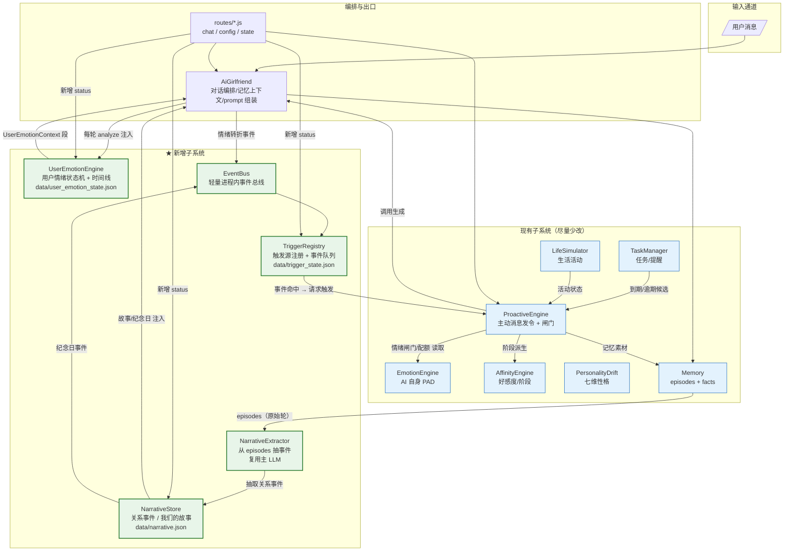
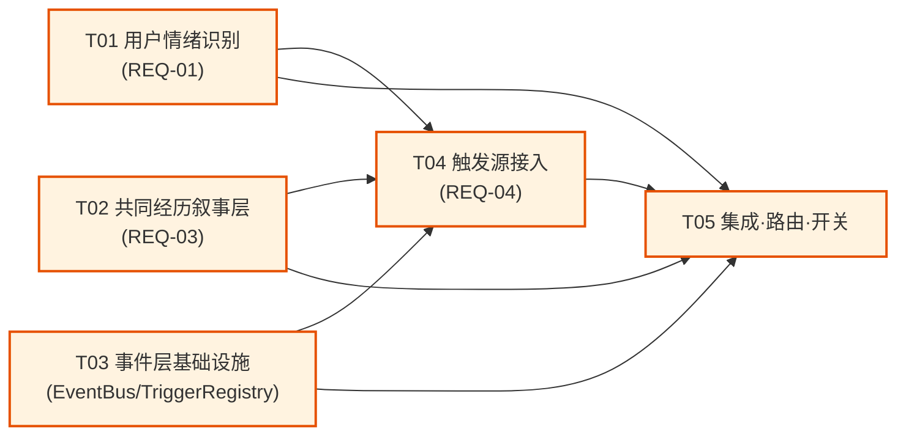
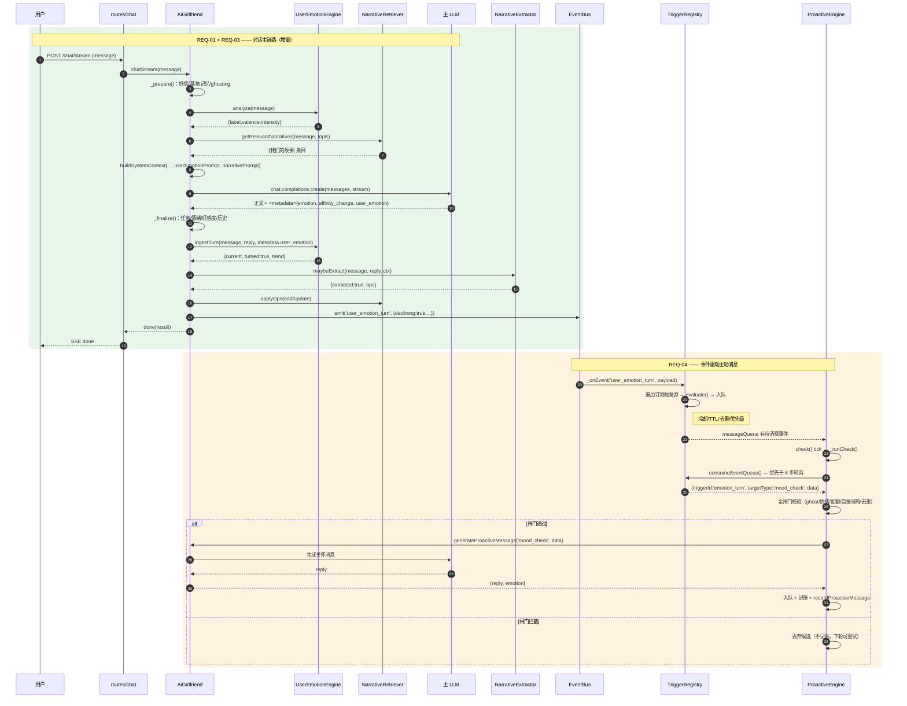

# 小爱 · 「增强陪伴感」技术架构与落地路线

- **项目**：ai-girlfriend（情感陪伴型 AI 女友「小爱」）
- **文档类型**：技术架构增量设计（非代码实现）
- **作者**：高见远（Gao，架构师）
- **上游输入**：`docs/companion-upgrade/PRD.md`（许清楚，PM）
- **日期**：2026-10-02
- **范围**：仅落地 PRD §4 收敛结论 —— **P0 三件套**（REQ-01 用户情绪识别 / REQ-03 共同经历叙事层 / REQ-04 事件驱动主动消息）。P1/P2 仅在依赖图上留出扩展点，不在本批实施范围。
- **前置约束（不可违反）**：
  1. **唯一事实源**：枚举 / 阈值 / 类型目录一律收敛到单一文件，其余模块派生。
  2. **数据统一走 `utils/jsonStore.js`**（原子写 + 损坏隔离），落 `backend-node/data/*.json`。
  3. **向后兼容**：现有 8 类主动消息（含定时问候、任务提醒）行为不能坏。
  4. **最小侵入**：优先「纯新增 + 少量挂钩」，避免重写既有引擎。
  5. **本文件为架构设计文档，不修改任何源码。**

---

## 0. 架构总原则与关键决策（TL;DR）

| 决策点 | 结论 | 理由 |
|---|---|---|
| 用户情绪从哪来 | **词表优先 + LLM 校准（混合）** | 词表零成本、可离线、当轮即得；LLM 只在信号模糊时兜底，兼顾成本与准确率 |
| 用户情绪持久化 | 新增独立 `UserEmotionEngine`，落 `data/user_emotion_state.json` | 与 AI 自身 `EmotionEngine` 完全解耦，互不污染；二者都是「唯一事实源」 |
| 叙事层重构方式 | **旁路追加**：新增 `NarrativeStore`，**不回改** `MemoryStore` schema | episodes 是原始轮次（不可变事实源），narrative 是从其派生的下游产物 |
| 叙事抽取时机 | **低频节流 + 事件触发**（非每轮） | 每轮调 LLM 抽取关系事件成本高、噪声大；按「轮次计数 + 时间窗 + 关键信号」节流 |
| 主动消息升级方式 | **引入轻量 `TriggerRegistry` + 事件队列，轮询退化为「tick 扫描」** | 保留 `ProactiveEngine` 作为唯一「发令与闸门」出口，新增触发源只注册、不改闸门逻辑 |
| 是否引入事件总线 | 引入**极简同步 EventBus**（进程内、无依赖） | 单机自用原型，不需要 MQ；同步回调足够，避免引入复杂度 |
| 兼容策略 | 新旧触发源**并存**：`_runCheck` 的 6 步规则判定**原样保留**，事件触发作为「更高优先级的额外来源」插入 | 老类型零回归；新机制可独立灰度 |

**一句话架构**：补一条「**看懂用户**」的输入通道（UserEmotionEngine），加一层「**关系会生长**」的派生记忆（NarrativeStore + NarrativeExtractor），把主动消息从「**定时自问**」升级为「**事件被通知**」（EventBus + TriggerRegistry），三者由 `AiGirlfriend` 编排、由 `ProactiveEngine` 统一发令。

---

## 1. 总体架构增量图

### 1.1 子系统关系（新增 vs 现有）



### 1.2 数据流向（一轮对话 + 一次主动触发）

**对话主链路（新增部分以 ★ 标注）**：

```
用户消息
 → AiGirlfriend._prepare()
     ├─ Layer -1/0/4/5（现有：好感度结算/基准/记忆/ghosting）
     ├─ ★ UserEmotionEngine.analyze(userInput, recentUserMsgs)   // REQ-01：更新用户情绪时间线
     ├─ ★ UserEmotionEngine.getPromptInjection()                 // REQ-01：注入 [User Emotion] 段
     ├─ ★ NarrativeStore.getRelevantNarratives(query)            // REQ-03：注入 [我们的故事] 段
     └─ buildSystemContext({ ..., userEmotionPrompt, narrativePrompt })
 → LLM 生成回复
 → AiGirlfriend._finalize()
     ├─ 现有：任务动作/情绪更新/好感度/性格/历史
     ├─ ★ UserEmotionEngine.ingestTurn(userInput, replyText, delta)  // 落盘时间线
     ├─ ★ NarrativeExtractor.maybeExtract(userInput, replyText)      // REQ-03：节流抽取
     └─ ★ EventBus.emit('user_emotion_turn', {...})                  // REQ-04：情绪转折事件
```

**主动消息链路（新增部分以 ★ 标注）**：

```
                          ┌─────────────────────────────────────────────┐
                          │  ProactiveEngine (发令 + 闸门，保持唯一出口)   │
                          └─────────────────────────────────────────────┘
                              ▲                    ▲
   ┌──────────────────────────┘                    └─────────────────────────┐
   │ （原有）每 30–60min tick 规则判定             （★ 新）事件到达时优先消费   │
   │  greeting / task / mood / miss / memory / random                           │
   └──────────────────────────────────────────────────────────────────────────┘
                              ▲
   ┌──────────────────────────┴──────────────────────────────────────────────┐
   │ ★ TriggerRegistry — 触发源统一注册 + 事件队列（优先级/TTL/冷却/去重）        │
   └──────────────────────────┬──────────────────────────────────────────────┘
                              ▲ (EventBus 订阅)
   ┌──────────────────────────┴──────────────────────────────────────────────┐
   │ ★ EventBus — 进程内发布订阅（同步回调，无外部依赖）                          │
   └──────────────────────────────────────────────────────────────────────────┘
        ▲                     ▲                       ▲                    ▲
   user_emotion_turn     narrative_milestone    topic_open/close      （扩展点）
   （情绪转折）           （纪念日/第一次）        （REQ-05 未闭环话题 P1）
```

---

## 2. 逐 P0 需求的技术方案

### REQ-01 用户情绪识别通道

#### 2.1.1 设计要点与关键决策

- **现状**：`EmotionEngine.analyzeInput()` 存在，但它是**词表矩阵**且服务于 **AI 自身 PAD**（`delta` 直接喂给 `emotionEngine.applyDelta`）。词表来自 `lexicon.js`（SAD / EXCITING / CALMING / PRAISE / CRITICISM / TEASING / QUESTION）。**没有用户情绪状态、没有用户情绪时间线**。
- **决策：混合方案（词表优先 + LLM 校准）**，理由：
  1. **词表层**复用 `lexicon.js` 已有词表（SAD/EXCITING/CALMING…）+ 新增用户情绪专用词表，零网络成本、当轮即得、可测试；对外暴露的 `valence/arousal/intensity` 与 PAD 同构，便于后续融合。
  2. **LLM 层**不新增调用轮次：**复用主对话 LLM 的 `<metadata>` 通道**——在主对话 prompt 中要求模型回报 `user_emotion` 字段（与现有 `emotion` / `affinity_change` / `emotion_delta` 同批返回），**零额外 API 调用**；词表结果与 LLM 结果做加权融合（词表为默认，LLM 权重更高、但需高于置信阈值才采信）。
  3. **兜底**：LLM 未返回 `user_emotion` 时纯用词表结果（保证功能不因模型不支持而失效，向后兼容）。
- **为什么不在每轮单独调 LLM 分类**：每轮多一次网络往返会拖慢主链路（首字延迟），且成本翻倍；metadata 复用是既有范式（任务意图识别已这么干）。
- **用户情绪模型**：采用 **valence(正负) + arousal(激活) + intensity(强度)** 三维，映射为标签（开心/平静/低落/焦虑/疲惫/兴奋/烦闷/愤怒/中性），与 AI 的 PAD 解耦（不复用 `EmotionEngine` 状态）。

#### 2.1.2 新增 / 修改文件清单

| 类型 | 相对路径 | 说明 |
|---|---|---|
| ★新增 | `backend-node/src/core/UserEmotionEngine.js` | 用户情绪状态机 + 时间线，落盘 `user_emotion_state.json` |
| ★新增 | `backend-node/src/core/userEmotionLexicon.js` | 用户情绪专用词表 + 强度词（唯一事实源） |
| ★新增 | `backend-node/src/core/prompts/userEmotionPrompt.js` | 构建注入 prompt 的 `[User Emotion]` 段 + 用户情绪 → 回应策略映射 |
| 修改 | `backend-node/src/core/AiGirlfriend.js` | ①构造 `UserEmotionEngine`；②`_prepare()` 调 `analyze()` 并注入段；③`_finalize()` 调 `ingestTurn()`；④`_parseReplyText()` 解析 `user_emotion` |
| 修改 | `backend-node/src/core/prompts/systemPrompt.js` | `buildSystemContext()` 新增 `userEmotionPrompt` 入参并插段；metadata 规范追加 `user_emotion` 字段说明 |
| 修改 | `backend-node/src/config.js` | 新增 `userEmotion` 配置块（开关/LLM 权重/时间线容量） |
| 修改 | `backend-node/src/routes/state.js`（或新增 `userEmotionRoutes.js`） | 暴露 `GET /state/user-emotion`（时间线，供 REQ-10 前端可选消费） |
| 修改 | `backend-node/src/services/container.js` | 无（UserEmotionEngine 由 AiGirlfriend 内部持有，随 `resetAll()` 重置） |

#### 2.1.3 核心类职责

**`UserEmotionEngine`**（新增）
- 持有当前用户情绪 `state = { valence, arousal, intensity }` 与时间线 `timeline[]`（滑动窗口，cap 由 config 控制）。
- `analyze(userInput, opts)`：词表快速分析 → 产出 `{ valence, arousal, intensity, label, confidence, source: 'lexicon' }`。**不落盘**（当轮即时用）。
- `fuse(lexiconResult, llmResult)`：融合词表与 LLM 结果，按权重与置信度产出最终情绪。
- `ingestTurn(userInput, replyText, llmUserEmotion)`：融合 → 更新 `state` → 追加 `timeline` → 落盘；返回「本轮情绪 + 是否发生显著转折」。
- `getPromptInjection()`：产出 `[User Emotion]` 段（当前用户情绪 + 近期趋势 + 回应策略提示）。
- `getRecentTrend(windowMs)`：近期趋势（用于回应策略与 REQ-04 情绪转折触发）。
- `getState()` / `getTimeline()` / `reset()` / `_load()` / `_save()`。

**`userEmotionLexicon.js`**（新增，**唯一事实源**）
- 用户情绪词表（复用 `lexicon.js` 的 SAD 等 + 新增：疲惫 `stressed`、愤怒 `angry`、焦虑 `anxious`、开心 `happy`、兴奋 `excited`…）。
- `USER_EMOTION_LABELS`（标签枚举）、`INTENSITY_MODIFIERS`（「特别/非常/有点/稍微」强度词）、`NEGATION_WORDS`（「不/没/别」否定词）。
- `classifyUserEmotion(text)` 纯函数：命中词 → 情绪维度与强度；供引擎与测试共用。

**`userEmotionPrompt.js`**（新增）
- `buildUserEmotionContext(emotion, trend)`：产出注入段。
- `USER_EMOTION_RESPONSE_STRATEGY`：情绪 → 回应策略映射表（难过→先共情后建议；开心→共享喜悦…），**此表是 REQ-02 的地基，本期只注入策略提示，不直接改回复逻辑**。

#### 2.1.4 关键数据结构（JSON schema）

`data/user_emotion_state.json`：
```jsonc
{
  "version": 1,
  "state": {
    "valence": -0.4,        // [-1,1] 负=不悦 正=愉悦
    "arousal": 0.2,         // [-1,1] 低=平静 高=激动
    "intensity": 0.6,       // [0,1] 情绪强度
    "label": "低落",         // 由三维映射（唯一映射表在 userEmotionLexicon.js）
    "updatedAt": 1759400000000
  },
  "timeline": [             // 滑动窗口，cap = config.userEmotion.timelineMax（默认 50）
    {
      "ts": 1759400000000,
      "valence": -0.4, "arousal": 0.2, "intensity": 0.6,
      "label": "低落",
      "source": "fused",     // lexicon | llm | fused
      "confidence": 0.72,     // [0,1]
      "excerpt": "今天真的太累了"  // 截断样例，仅用于调试/前端展示
    }
  ],
  "lastUpdated": "2026-10-02T12:00:00.000Z"
}
```

**LLM metadata 契约（追加字段，向后兼容）**：
```jsonc
// AiGirlfriend._parseReplyText 解析出的 metadata 新增可选字段
{
  "emotion": "平静",              // 现有：AI 自身情绪标签
  "affinity_change": 0,          // 现有
  "emotion_delta": { "P": 0, "A": 0, "D": 0 },  // 现有
  "user_emotion": {              // ★ 新增，老模型不返回时恒为 null
    "label": "低落",
    "valence": -0.5, "arousal": 0.1, "intensity": 0.7,
    "confidence": 0.8
  }
}
```

#### 2.1.5 与现有模块的接口契约

```js
// UserEmotionEngine 对外（AiGirlfriend 消费）
new UserEmotionEngine()                        // 无参，自持持久化
analyze(userInput) -> LexiconEmotion           // 同步，纯计算
ingestTurn(userInput, replyText, llmUserEmotion|null)
   -> { current: Emotion, turned: boolean, trend: TrendInfo }
getPromptInjection() -> string                 // 注入段，无内容时返回 ''
getState() -> { state, timelineStats }          // 供路由
getRecentTrend(windowMs) -> { avgValence, slope, declining }
reset()                                         // 纳管 AiGirlfriend.resetAll()
```

#### 2.1.6 对现有代码的侵入点

| 侵入点 | 文件 / 位置 | 风险 |
|---|---|---|
| I1 | `AiGirlfriend` 构造器新增 `this.userEmotionEngine = new UserEmotionEngine()` | 低（纯新增） |
| I2 | `AiGirlfriend._prepare()` 在记忆上下文后调 `analyze()` 并传入 `buildSystemContext` | 中：需保证 `analyze()` 同步、不抛异常（失败降级为空段） |
| I3 | `AiGirlfriend._finalize()` 调 `ingestTurn()` | 低：在后台路径（`_persistAfterReply` 同批），不阻塞响应 |
| I4 | `AiGirlfriend._parseReplyText()` 解析 `user_emotion` | 低：可选字段，缺失即 null |
| I5 | `buildSystemContext()` 新增入参 | 低：入参缺省为空串 = 行为不变 |
| I6 | `resetAll()` 步骤数组追加 `['userEmotion', () => this.userEmotionEngine?.reset()]` | 低：容错循环已就绪 |

---

### REQ-03 共同经历叙事层

#### 2.3.1 设计要点与关键决策

- **现状**：`MemoryStore.episodes` 是**原始对话轮**（不可变事实源），`facts` 是提取式持久信息。**没有关系叙事**。`FactExtractor` 已有成熟的「LLM + JSON ops + 去重 + cap」范式，**直接复用其设计范式**（而非复用类本身，因为语义不同）。
- **关键决策：旁路追加，不改 MemoryStore schema**
  - `episodes` 是「事实源」，`narrative` 是从它**派生**的下游产物。两者**各自独立存储**（`narrative.json`），避免「派生数据污染事实源」。
  - `NarrativeExtractor` 复用 `getChatClient` 通道（与 `FactExtractor` 同款注入方式），**复用主 LLM，不新增 provider**。
- **抽取时机 = 三层节流**（关键，防成本失控）：
  1. **轮次节流**：每 N 轮对话（`config.narrative.extractEveryNTurns`，默认 5）尝试一次；
  2. **时间窗节流**：距上次抽取 ≥ `minIntervalMs`（默认 10min）；
  3. **信号节流**：仅当本轮或近期命中「关键信号」（第一次/约定/纪念日词、好感度跃迁、用户情绪强转折）才真正调用 LLM。
  - 三者**全部满足**才抽取，显著降低 LLM 调用频次（估算从「每轮 1 次」降至「每 5–10 轮 1 次」）。
- **去重**：沿用 `MemoryStore` 的余弦 + 归一化包含判定范式（`FactExtractor.isDuplicateFact` 思路），对「同一事件」做幂等更新（`update` 而非重复 `add`）。
- **cap**：`narrative` 按 `importance` + `recency` 裁剪，`config.narrative.maxNarratives`（默认 60）。
- **检索**：`getRelevantNarratives(query)` 复用 `MemoryRetriever` 范式（语义/关键词双模），从 narrative 池取 topK 注入；另提供 `getUpcomingAnniversaries(date)` 供 REQ-04。

#### 2.3.2 新增 / 修改文件清单

| 类型 | 相对路径 | 说明 |
|---|---|---|
| ★新增 | `backend-node/src/core/narrative/NarrativeStore.js` | 关系事件持久化（schema v1），cap + 去抖落盘 |
| ★新增 | `backend-node/src/core/narrative/NarrativeExtractor.js` | 从轮次抽关系事件，复用主 LLM（JSON ops 范式） |
| ★新增 | `backend-node/src/core/narrative/narrativeTypes.js` | **唯一事实源**：事件类型枚举 + 抽取 prompt 常量 + 类型元数据 |
| ★新增 | `backend-node/src/core/narrative/NarrativeRetriever.js` | 叙事检索（注入用）+ 纪念日/待回顾查询（REQ-04 用） |
| ★新增 | `backend-node/src/core/prompts/narrativePrompt.js` | 构建注入 prompt 的 `[我们的故事]` 段 |
| 修改 | `backend-node/src/core/AiGirlfriend.js` | ①构造 Narrative 子系统；②`_prepare()` 注入 `[我们的故事]`；③`_finalize()` 调 `maybeExtract()`；④`resetAll()` 追加重置；⑤访问器/导出方法 |
| 修改 | `backend-node/src/core/prompts/systemPrompt.js` | `buildSystemContext()` 追加 `narrativePrompt` 入参并插段 |
| 修改 | `backend-node/src/config.js` | 新增 `narrative` 配置块 |
| 修改 | `backend-node/src/routes/state.js` | 暴露 `GET /state/narratives`（我们的故事列表） |
| 修改 | `backend-node/src/services/container.js` | 停机时 flush narrative（与 memory flush 并列） |

#### 2.3.3 核心类职责

**`NarrativeStore`**（新增，持久化层，对标 `MemoryStore`）
- 持有 `narratives[]`，读写 `data/narrative.json`（schema v1，去抖 `scheduleSave()`）。
- `addNarrative({...})` / `updateNarrative(id, {...})` / `removeNarrative(id)` / `capNarratives()`。
- `flush()`（停机兜底）。

**`NarrativeExtractor`**（新增，抽取层，对标 `FactExtractor`）
- `maybeExtract(userInput, replyText, ctx) -> { extracted: boolean, ops }`：执行三层节流判定，命中才调 LLM。
- 复用 `getChatClient` 注入；`EXTRACT_NARRATIVE_SYSTEM_PROMPT` 在 `narrativeTypes.js`。
- `parseNarrativeOps(raw)`：容错解析（剥栅栏/截首尾括号/字段校验，复用 `FactExtractor` 的范式）。

**`NarrativeRetriever`**（新增，检索层）
- `getRelevantNarratives(query, topK)`：语义/关键词双模（复用 `textSim` + `EmbeddingClient`）。
- `getUpcomingAnniversaries(now, withinDays)`：返回即将到来的纪念日（REQ-04 触发源）。
- `getRandomStory(excludeRecentN)`：供主动消息「主动回顾共同经历」用（升级现有 `memory_share`）。

**`narrativeTypes.js`**（新增，**唯一事实源**）
- `NARRATIVE_TYPES`：`first_time`(第一次) / `anniversary`(纪念日) / `promise`(约定) / `inside_joke`(专属梗) / `milestone`(关系里程碑) / `shared_event`(共同经历)。
- 每类的 `label / labelZh / extractHint / importanceBase / recurring`。
- 抽取 prompt 常量。

#### 2.3.4 关键数据结构（JSON schema）

`data/narrative.json`：
```jsonc
{
  "version": 1,
  "narratives": [
    {
      "id": "n_1759...",                 // uuid
      "type": "milestone",              // narrativeTypes.js 枚举
      "title": "第一次说晚安",           // 短标题（≤20字）
      "summary": "用户第一次和小爱互道晚安，小爱记下了这个瞬间。",
      "occurredAt": 1759400000000,      // 事件发生时间（可早于抽取出时间）
      "sourceEpisodeId": "ep_...",      // 溯源到 episodes（可选）
      "participants": ["user", "xiaoi"],
      "importance": 4,                  // 1-5
      "recurring": {                    // 纪念日类才有
        "isAnniversary": true,
        "anniversaryDate": "10-01",     // MM-DD（年度循环）
        "anniversaryType": "monthly"    // monthly | yearly | once
      },
      "jokeTrigger": "晚安梗",           // 专属梗触发词（inside_joke 用）
      "tags": ["晚安", "日常"],
      "embedding": null,                // 检索向量（无嵌入时为 null）
      "embeddingModel": null,
      "createdAt": 1759400000000,
      "updatedAt": 1759400000000,
      "recallCount": 0,                 // 被主动回顾次数（防复读）
      "lastRecalledAt": null
    }
  ],
  "stats": { "lastExtractTurn": 42, "lastExtractAt": 1759400000000 },
  "lastUpdated": "2026-10-02T12:00:00.000Z"
}
```

**抽取输出契约（LLM JSON ops，对标 FactExtractor）**：
```jsonc
{
  "add": [
    { "type": "promise", "title": "答应陪他复习", "summary": "...",
      "importance": 4, "recurring": null }
  ],
  "update": [ { "id": "n_...", "summary": "...", "importance": 5 } ],
  "delete": ["n_..."]
}
```

#### 2.3.5 与现有模块的接口契约

```js
// Narrative 子系统对外（AiGirlfriend 消费）
new NarrativeStore()                                      // 自持持久化
new NarrativeExtractor({ getClient })                     // 复用主 LLM 通道
new NarrativeRetriever({ store, embedding })              // 双模检索

maybeExtract(userInput, replyText, { turnCount, affinity, userEmotion })
   -> { extracted: boolean, ops: {add,update,delete} }
getRelevantNarratives(query, topK) -> Narrative[]         // 注入用
getUpcomingAnniversaries(now, withinDays) -> Narrative[]  // REQ-04 触发源
getRandomStory(excludeRecentN) -> Narrative|null          // 升级 memory_share
getAll() -> { narratives, stats }                         // 路由导出
reset()                                                    // resetAll()
```

**与 `Memory` 的关系**：Narrative 子系统**只读** `episodes`（通过 `Memory.store.episodes` 或传入轮次文本），**绝不写** `MemoryStore`。二者生命周期独立（`resetAll()` 各自重置）。

#### 2.3.6 对现有代码的侵入点

| 侵入点 | 文件 / 位置 | 风险 |
|---|---|---|
| I7 | `AiGirlfriend` 构造器新增 Narrative 三件套实例 | 低（纯新增） |
| I8 | `AiGirlfriend._prepare()` 注入 `[我们的故事]` 段 | 中：检索失败需降级为空段 |
| I9 | `AiGirlfriend._finalize()` 调 `maybeExtract()` | 低：在后台队列（setImmediate），三层节流控频 |
| I10 | `buildSystemContext()` 新增 `narrativePrompt` 入参 | 低：缺省为空串 = 不变 |
| I11 | `resetAll()` 步骤追加 narrative 重置 | 低 |
| I12 | `Memory.getRandomMemory` 的消费方（`_buildProactiveContext`）可能改走 `getRandomStory` | 中（REQ-04 内，见下） |

---

### REQ-04 事件驱动主动消息（**最关键架构改造**）

#### 2.4.1 设计要点与关键决策

- **现状**：`ProactiveEngine` 是 **`setInterval(60s) → _runCheck()`** 的**定时轮询 + 顺序规则判定**（6 步：定时问候 → 任务提醒 → 情绪关怀 → 想念 → 回忆 → 随机闲聊）。所有闸门（情绪闸门 / 深夜免打扰 / 配额 / 自发全局间隔 / 冷却）都在引擎内。
- **核心矛盾**：轮询无法表达「**事件发生的那一刻**」（用户说「下周考试」→ 到考试前夕该关心；用户情绪刚崩 → 该立刻共振；纪念日到了 → 该回顾）。
- **关键决策：不重写引擎，引入「事件层」叠加在轮询之上**：
  1. **`EventBus`（新增，进程内同步发布订阅）**：极简 API（`on/off/emit`），无外部依赖。承载「业务事件」（情绪转折、叙事里程碑、话题开闭…）。
  2. **`TriggerRegistry`（新增）**：**触发源统一注册表 + 事件队列**。每个触发源（Trigger）声明：`id / 订阅的事件 / 判定函数 / 目标 proactive type / 优先级 / 冷却 / TTL`。事件到达时 TriggerRegistry 判定 → 入队候选 → 通知 ProactiveEngine。
  3. **`ProactiveEngine` 保持「唯一发令出口」**：新增 `consumeEventQueue()`——在每次 `_runCheck()` **最前面**（定时问候之前）优先消费事件队列。**原有 6 步规则判定原样保留**，作为「兜底/无事件时的默认行为」。
  4. **闸门复用**：事件触发的消息**仍走 `trigger()` 的全部闸门**（情绪/ghost/配额/自发间隔/去重/队列 TTL）——**复用而非旁路**，保证「事件驱动」不会变成「闸门失效」。
- **触发源（本期实现 3 个，扩展点留给 P1）**：
  | 触发源 id | 订阅事件 | 目标 type | 优先级 | 说明 |
  |---|---|---|---|---|
  | `emotion_turn` | `user_emotion_turn` | `mood_check`(升级语义) | 高 | 用户情绪显著转负 → 触发共情关怀 |
  | `anniversary` | `narrative_milestone` | `memory_share`(升级语义) | 中 | 共同经历纪念日 → 主动回顾 |
  | `promise_followup` | `narrative_milestone` | `memory_share` | 中 | 约定类事件到期 → 追问闭环（REQ-05 地基） |
- **事件驱动的「关键拐点（情绪转折）」判定**：由 `UserEmotionEngine.getRecentTrend()` 产出（如 `valence` 由正转负、或 `intensity` 突增），经 `EventBus.emit('user_emotion_turn')` 发布。
- **向后兼容的强保证**：
  - 事件层**默认可用但可关**：`config.triggerRegistry.enabled`。
  - 关闭时：`consumeEventQueue()` 直接返回，`_runCheck()` 行为与改造前**逐字节一致**。
  - 新增 type 若命中失败（LLM 挂/闸门拦），**不记账、下轮可重试**（复用现有 `trigger()` 返回 boolean 的契约）。
  - **不改** `proactiveTypes.js` 的现有 8 条定义（只**追加**新的字段，如 `eventDriven: true`）；**不改** `_runCheck` 的 6 步顺序。

#### 2.4.2 新增 / 修改文件清单

| 类型 | 相对路径 | 说明 |
|---|---|---|
| ★新增 | `backend-node/src/core/EventBus.js` | 轻量进程内事件总线（on/off/emit/once） |
| ★新增 | `backend-node/src/core/TriggerRegistry.js` | 触发源注册 + 事件队列（优先级/TTL/冷却/去重）落 `trigger_state.json` |
| ★新增 | `backend-node/src/core/triggers/emotionTurnTrigger.js` | 情绪转折触发源 |
| ★新增 | `backend-node/src/core/triggers/anniversaryTrigger.js` | 纪念日触发源 |
| ★新增 | `backend-node/src/core/triggers/promiseFollowupTrigger.js` | 约定/承诺跟进触发源 |
| ★新增 | `backend-node/src/core/triggerEvents.js` | **唯一事实源**：事件名枚举 + 事件 payload 契约 + 触发源类型定义 |
| 修改 | `backend-node/src/core/ProactiveEngine.js` | ①构造 Receive `TriggerRegistry`；②`_runCheck()` **开头**加 `consumeEventQueue()` 优先消费；③`getStatus()` 追加事件队列状态；④**6 步规则原样保留** |
| 修改 | `backend-node/src/core/proactiveTypes.js` | **追加**（非修改）新字段 `eventDriven` / 新类型（如 `emotion_resonance`），旧字段不动 |
| 修改 | `backend-node/src/core/AiGirlfriend.js` | ①构造 EventBus + TriggerRegistry + 触发源注册；②`_finalize()` 发布 `user_emotion_turn` 事件；③Narrative 里程碑发布事件 |
| 修改 | `backend-node/src/core/prompts/proactivePrompts.js` | **追加**新 type 的 prompt 分支（旧分支不动） |
| 修改 | `backend-node/src/services/container.js` | 装配顺序：EventBus → TriggerRegistry → 订阅注册 → ProactiveEngine |
| 修改 | `backend-node/src/routes/chat.js` | `GET /chat/proactive/status` 追加事件队列；可选 `POST /chat/proactive/trigger` 支持事件触发 |
| 修改 | `backend-node/src/config.js` | 新增 `triggerRegistry` 配置块 |

#### 2.4.3 核心类职责

**`EventBus`**（新增）
- `on(event, handler)` / `off(event, handler)` / `once(event, handler)` / `emit(event, payload)`。
- 同步派发；handler 异常被捕获并记日志（**单个订阅者失败不影响其他订阅者**）。
- 无持久化（事件是瞬时的；需持久化的是**队列**，见 TriggerRegistry）。

**`TriggerRegistry`**（新增，核心）
- `register(triggerDef)`：注册触发源（`id / events / evaluate(payload, ctx) → candidate|null / targetType / priority / cooldownMs / ttlMs`）。
- `attach(bus)`：订阅所有触发源声明的事件。
- `_onEvent(event, payload)`：遍历订阅该事件的触发源 → `evaluate()` → 命中则入队 `eventQueue`（带 priority / ttl / dedupeKey / createdAt）。
- `consume()`：取出优先级最高、未过期的一条（返回 `{targetType, data, triggerId}` 或 null）；命中即写冷却与去重标记。
- `getStatus()`：队列快照 + 各触发源下次可触发时间。
- 持久化 `data/trigger_state.json`（队列 + 触发源冷却/去重标记）。
- **与 ProactiveEngine 的契约**：`consume()` 只产出「候选请求」，**是否真正发送由 ProactiveEngine 的 `trigger()` 全闸门决定**。

**`triggerEvents.js`**（新增，**唯一事实源**）
- `TRIGGER_EVENTS = { USER_EMOTION_TURN: 'user_emotion_turn', NARRATIVE_MILESTONE: 'narrative_milestone', TOPIC_OPEN/TOPIC_CLOSE: 'topic_open'/'topic_close' }`。
- 每种事件的 payload schema 常量（供触发源与发布方对齐）。
- `TRIGGER_DEFS` 元数据（优先级默认值等）。

**触发源模块**（新增，每个一个文件）
- 每个导出 `{ id, events, evaluate, targetType, priority, cooldownMs, ttlMs }`。
- `evaluate(payload, ctx)` 返回候选或 null（纯函数，易测）。

#### 2.4.4 关键数据结构（JSON schema）

`data/trigger_state.json`：
```jsonc
{
  "version": 1,
  "eventQueue": [
    {
      "id": "q_1759...",
      "triggerId": "emotion_turn",
      "targetType": "mood_check",       // 目标 ProactiveEngine type
      "priority": 70,                    // 队列排序
      "data": { "valence": -0.6, "label": "低落", "trend": "declining" },
      "dedupeKey": "emotion_turn:negative:1759400000",  // 防重复
      "createdAt": 1759400000000,
      "expiresAt": 1759403600000         // 超时丢弃，不占用任何配额
    }
  ],
  "cooldowns": { "emotion_turn": 1759400000000, "anniversary": 0 },
  "dedupeSeen": { "emotion_turn:negative:1759400000": 1759400000000 },
  "lastUpdated": "2026-10-02T12:00:00.000Z"
}
```

**事件 payload 契约**：
```jsonc
// 'user_emotion_turn'
{ "valence": -0.6, "arousal": 0.3, "intensity": 0.7, "label": "低落",
  "turned": true, "trend": { "avgValence": -0.4, "slope": -0.3, "declining": true },
  "ts": 1759400000000 }

// 'narrative_milestone'
{ "narrativeId": "n_...", "type": "anniversary", "title": "第一次说晚安",
  "occurredAt": 1759400000000, "anniversary": true, "daysAgo": 30 }
```

#### 2.4.5 与现有模块的接口契约

```js
// EventBus
new EventBus()
bus.on(event, handler) / bus.off(event, handler) / bus.emit(event, payload)

// TriggerRegistry
new TriggerRegistry({ bus, config })
registry.register(triggerDef)
registry.consume() -> { triggerId, targetType, data } | null
registry.getStatus() -> { queue: [...], cooldowns: {...} }
registry.reset()

// ProactiveEngine（新增/改动，旧 API 不变）
consumeEventQueue() -> boolean           // _runCheck 开头调用；消费成功返回 true
getStatus()                              // 追加 eventQueue 字段（向后兼容：只加不改）
trigger(reason, data)                    // 契约不变：仍返回 boolean
```

#### 2.4.6 对现有代码的侵入点（**最高风险区**）

| 侵入点 | 文件 / 位置 | 风险 | 缓解 |
|---|---|---|---|
| I13 | `ProactiveEngine._runCheck()` **开头**新增 `if (this.consumeEventQueue()) return;` | **中高**：改动了主判定入口 | 事件队列为空时立即返回 false → **逐字节等价**于改造前；开关可关 |
| I14 | `ProactiveEngine` 构造器接收 `triggerRegistry` | 中：装配顺序 | `container.js` 保证顺序；缺省时（null）事件层整体降级为 no-op |
| I15 | `proactiveTypes.js` 追加 `eventDriven` 字段与新 type | 低：纯追加 | 旧 type 字段不动；未知字段不影响旧逻辑 |
| I16 | `_finalize()` 发布事件 | 低：`emit` 同步但对无订阅者零开销 | handler 异常被 EventBus 吞掉 |
| I17 | `getStatus()` 追加字段 | 低：只加不改 | 前端旧字段仍在 |
| I18 | `container.js` 装配顺序 | 中：装配错会导致事件层失效 | 明确顺序：Bus → Registry → register → ProactiveEngine(registry) |

---

## 3. 兼容性与风险

### 3.1 纯新增（零风险）

| 新增物 | 说明 |
|---|---|
| `UserEmotionEngine.js` / `userEmotionLexicon.js` / `userEmotionPrompt.js` | REQ-01 三件套，独立文件 |
| `narrative/*`（Store/Extractor/Retriever/Types） + `narrativePrompt.js` | REQ-03 全套 |
| `EventBus.js` / `TriggerRegistry.js` / `triggerEvents.js` / `triggers/*` | REQ-04 事件层 |
| 新数据文件：`user_emotion_state.json` / `narrative.json` / `trigger_state.json` | 新文件，旧数据零影响 |
| 新路由：`/state/user-emotion`、`/state/narratives` | 新增 endpoint |
| `config.js` 新增三个配置块 | 只加字段 |

### 3.2 会动到现有代码（侵入点与回归风险）

| ID | 文件 | 侵入 | 回归风险 | 回归验证点 |
|---|---|---|---|---|
| I2,I8 | `AiGirlfriend._prepare()` | 追加两段 prompt 注入 + 两次只读查询 | 中：若注入段抛异常会拖垮主链路 | 注入失败必须 try/catch 降级为空段；对比注入前后回复不劣化 |
| I3,I9 | `AiGirlfriend._finalize()` | 追加 `ingestTurn` + `maybeExtract` + `emit` | 中：必须在后台路径，不得阻塞响应 | 实测首字延迟（TTFT）不退化 |
| I4 | `_parseReplyText()` | 解析 `user_emotion` 可选字段 | 低 | 老模型无该字段 → null，行为不变 |
| I5,I10 | `buildSystemContext()` | 新增两个可选入参 | 低 | 缺省空串 = 旧输出 |
| I13 | `ProactiveEngine._runCheck()` | **开头**加事件消费 | **中高** | 事件层关闭时输出与改造前逐字节一致（建议加对照测试） |
| I15 | `proactiveTypes.js` | 追加字段/类型 | 低 | 现有 8 类定义不变；`PROACTIVE_TYPE_IDS` 向前兼容（只增） |
| I11 | `resetAll()` | 追加 userEmotion / narrative / registry 重置 | 低 | 容错循环已就绪 |
| — | `container.js` | 装配顺序 | 中 | 启动日志确认事件层已装配 |

**高风险点专项**：**I13 是本次唯一真正的「架构级侵入」**。缓解策略：
1. `consumeEventQueue()` 在事件层关闭 / 队列空时 **O(1) 返回 false**，`_runCheck` 后续流程完全不变；
2. 提供 `config.triggerRegistry.enabled=false` 一键回退到「纯轮询」；
3. 建议上线时先以 `enabled=false` 部署（零行为变更），观察一轮后开启。

### 3.3「唯一事实源」约定如何贯彻

| 事实源文件 | 收敛内容 | 派生方 |
|---|---|---|
| `lexicon.js`（现有） | 关系/情绪**词表** | `EmotionEngine`、`userEmotionLexicon`（复用 SAD 等） |
| `relationshipStages.js`（现有） | 好感度**阶段阈值** | 全部模块派生，禁止各写一套 |
| `proactiveTypes.js`（现有） | 主动消息**类型目录** | 引擎 + 路由派生；本次**追加**不改 |
| `userEmotionLexicon.js`（★新） | 用户情绪**标签/词表/映射表** | `UserEmotionEngine` + prompt |
| `narrativeTypes.js`（★新） | 叙事**事件类型枚举** + 抽取 prompt | Store/Extractor/Retriever |
| `triggerEvents.js`（★新） | **事件名 + payload 契约 + 触发源元数据** | EventBus/Registry/触发源 |
| `config.js`（现有） | 所有**运行时数值** | 各模块读 `config.*`，不硬编码 |

**铁律**：新增模块里**禁止**出现魔法数字（阈值/冷却/容量一律进 `config.js` 或对应 `*Types.js`）。`ProactiveEngine` 里已有的 `STAGE_ECONOMY / FREQUENCY / QUIET_HOURS` 等继续作为其私有唯一源，新触发源**不得另抄一份**。

### 3.4 性能影响

| 维度 | 影响 | 说明与缓解 |
|---|---|---|
| **本地 JSON 全量读写** | 新增 3 个状态文件 | `user_emotion_state.json`（≤50 条时间线，小）、`narrative.json`（≤60 条，中小）、`trigger_state.json`（小）。沿用 `jsonStore` 原子写 + `scheduleSave` 去抖；**禁止每轮同步全量重写**（时间线走去抖，参照 `MemoryStore`） |
| **LLM 调用成本** | REQ-01 **零额外调用**（复用 metadata）；REQ-03 **节流抽取**（每 5–10 轮 1 次，温度低、max_tokens 800） | 估算增量 ≈ 主对话调用量的 **10–20%**（叙事抽取）+ 事件触发时的主动消息生成（受现有配额上限约束，**不新增无界调用**） |
| **prompt 长度** | 新增 `[User Emotion]` + `[我们的故事]` 两段 | 各限长（情绪段 ≤6 行，故事段 topK=2–3 且单条截断），整体控制在 300 字内；`maxPromptHistory` 机制不受影响 |
| **内存占用** | 3 个新内存数组 | 均 cap 上限，可忽略 |
| **启动/停机** | 停机需 flush 新文件 | `shutdownServices()` 追加 narrative flush，与 memory flush 并列 |

---

## 4. 实施顺序与依赖图

### 4.1 分批实施计划

> 原则：**REQ-01 与 REQ-03 可并行**（都是「输入/记忆地基」），**REQ-04 依赖两者**（情绪转折 + 纪念日是其触发源）。

| 批次 | 内容 | 依赖 | 可独立验证点 |
|---|---|---|---|
**B1** | **REQ-01 用户情绪识别** | 无 | ①`user_emotion_state.json` 正确落盘；②注入段出现在 system context；③词汇/LLM 融合结果符合预期；④老模型不返回 `user_emotion` 时降级正常 |
| **B2** | **REQ-03 共同经历叙事层** | 无（与 B1 并行） | ①节流生效（非每轮抽取）；②`narrative.json` 事件去重 + cap 正确；③`[我们的故事]` 注入不劣化回复；④`getUpcomingAnniversaries` 返回正确 |
| **B3** | **REQ-04 事件层基础设施** | B1、B2（触发源需要情绪/叙事数据，但 EventBus/Registry 本身可先行） | ①EventBus 单测；②TriggerRegistry 注册/消费/冷却/去重/持久化；③`enabled=false` 时 `_runCheck` 行为与改造前一致（对照测试） |
| **B4** | **REQ-04 触发源接入** | B3 | ①3 个触发源端到端；②事件触发的主动消息正确入队且**走全闸门**；③旧 8 类零回归 |
| **B5** | **集成、路由、配置开关、文档** | B1–B4 | ①`/state/*` 新端点；②`config` 三个开关热更新；③`resetAll()` 覆盖新模块；④停机 flush |

### 4.2 任务分解（供 Engineer 施工）

| Task | 名称 | 源文件（相对路径） | 依赖 | 优先级 |
|---|---|---|---|---|
| **T01** | 用户情绪识别通道（REQ-01） | `core/UserEmotionEngine.js`、`core/userEmotionLexicon.js`、`core/prompts/userEmotionPrompt.js`、改 `core/AiGirlfriend.js`、改 `core/prompts/systemPrompt.js`、改 `config.js`、改 `routes/state.js` | 无 | P0 |
| **T02** | 共同经历叙事层（REQ-03） | `core/narrative/NarrativeStore.js`、`core/narrative/NarrativeExtractor.js`、`core/narrative/NarrativeRetriever.js`、`core/narrative/narrativeTypes.js`、`core/prompts/narrativePrompt.js`、改 `core/AiGirlfriend.js`、改 `core/prompts/systemPrompt.js`、改 `config.js`、改 `routes/state.js` | 无 | P0 |
| **T03** | 事件层基础设施（REQ-04 地基） | `core/EventBus.js`、`core/TriggerRegistry.js`、`core/triggerEvents.js`、改 `core/ProactiveEngine.js`（仅 `consumeEventQueue` 挂钩 + status）、改 `services/container.js`、改 `config.js` | 无 | P0 |
| **T04** | 触发源接入与生成链路（REQ-04） | `core/triggers/emotionTurnTrigger.js`、`core/triggers/anniversaryTrigger.js`、`core/triggers/promiseFollowupTrigger.js`、改 `core/AiGirlfriend.js`（发布事件）、改 `core/proactiveTypes.js`（追加）、改 `core/prompts/proactivePrompts.js`（追加） | T01、T02、T03 | P0 |
| **T05** | 集成·路由·开关·重置·停机 | 改 `routes/chat.js`、改 `routes/configRoutes.js`、改 `services/container.js`、改 `core/AiGirlfriend.js`（`resetAll` 扩展/访问器）、文档同步 | T01–T04 | P0 |

> 注：T01/T02/T03 三者的公共侵入对象是 `AiGirlfriend.js` 与 `config.js`，建议先由 **T03**（最独立、风险最高）落地并加上「`enabled=false` 对照测试」基线，再并行 T01、T02，最后 T04/T05 收口。

### 4.3 任务依赖图



---

## 5. 待明确事项（架构层面需产品/用户拍板）

> 以下问题会**直接改变设计参数**（而非仅影响文案），建议在 T01 动手前确认。与 PRD §5 的 Q1–Q5 对应。

| # | 架构面问题 | 影响的架构参数 | 若不确认的默认假设 |
|---|---|---|---|
| A1 | **用户情绪来源策略**：是否接受「词表 + LLM metadata 融合」？还是要求**每轮独立 LLM 分类**（更准但更慢更贵）？ | `UserEmotionEngine` 是否保留 LLM 融合路径；`config.userEmotion.llmWeight` | 默认**融合**，LLM 失败时纯词表 |
| A2 | **叙事抽取频率**：每 5 轮 / 每 10 轮 / 仅关键信号？ | `config.narrative.extractEveryNTurns`、`minIntervalMs` | 默认 **5 轮 + 10min + 信号**，三者与门 |
| A3 | **主动消息频率基线**（PRD Q3）：安静型（1–3/天）还是黏人型（8–15/天）？ | 决定**事件触发的配额占比**——事件驱动消息是否**也吃配额**？是否单列「事件豁免配额」？ | 默认**事件消息也吃配额**（保守，防打扰），由 `frequencyLevel` 统一缩放 |
| A4 | **主动引用记忆/叙事的尺度**（PRD Q4）：她多主动地提「你上次说…」？ | `NarrativeRetriever` 的注入激进度 + `memory_share` 升级后的触发概率上限 | 默认**克制**：注入 topK=2、主动提起概率上限 0.3 |
| A5 | **负面用户情绪的处理边界**（PRD Q2）：用户难过时，事件触发是「立刻关怀」还是「等她情绪也低落再回应」？是否允许 AI 情绪随之低落（true attunement）？ | 决定 `emotionTurnTrigger` 是否**同时**驱动 AI 自身 `EmotionEngine`（跨界耦合与否） | 默认**不跨界**：REQ-01 只识别与注入，**不改 AI 情绪**（真实共振留给 REQ-02） |
| A6 | **是否允许事件消息突破深夜免打扰**（如用户凌晨情绪崩溃）？ | `TriggerRegistry` 事件的 `quietExempt` 策略 | 默认**不豁免**（沿用现有免打扰），凌晨仅记录不发送 |
| A7 | **叙事与记忆的覆盖/删除联动**：用户删除某条 episode 时，派生的 narrative 是否级联删除？ | `NarrativeStore` 是否需要 `deleteBySourceEpisode` | 默认**不级联**（各自独立），提供手动删除接口即可 |

---

## 附录 A：类图（classDiagram）

```mermaid
classDiagram
    class AiGirlfriend {
        +affinityEngine
        +emotionEngine
        +personalityDrift
        +memory
        +userEmotionEngine
        +narrativeStore
        +narrativeExtractor
        +narrativeRetriever
        +eventBus
        +triggerRegistry
        +_prepare(userInput)
        +_finalize(parsed, userInput)
        +_parseReplyText(raw, userInput, hints)
        +generateProactiveMessage(reason, data)
        +resetAll()
    }

    class UserEmotionEngine {
        +state: {valence,arousal,intensity,label}
        +timeline: EmotionPoint[]
        +analyze(userInput) LexiconEmotion
        +fuse(lexicon, llm) Emotion
        +ingestTurn(userInput, replyText, llmUserEmotion) TurnResult
        +getPromptInjection() string
        +getRecentTrend(windowMs) TrendInfo
        +reset()
        -_load() / _save()
    }

    class NarrativeStore {
        +narratives: Narrative[]
        +addNarrative(n) Narrative
        +updateNarrative(id, patch)
        +removeNarrative(id)
        +capNarratives()
        +flush()
        -_load() / _save()
    }

    class NarrativeExtractor {
        +getClient
        +maybeExtract(userInput, replyText, ctx) ExtractResult
        +parseNarrativeOps(raw) Ops
    }

    class NarrativeRetriever {
        +getRelevantNarratives(query, topK) Narrative[]
        +getUpcomingAnniversaries(now, withinDays) Narrative[]
        +getRandomStory(excludeRecentN) Narrative
    }

    class EventBus {
        +on(event, handler)
        +off(event, handler)
        +once(event, handler)
        +emit(event, payload)
    }

    class TriggerRegistry {
        +eventQueue: QueueItem[]
        +register(triggerDef)
        +attach(bus)
        +consume() Candidate
        +getStatus() Status
        +reset()
        -_onEvent(event, payload)
    }

    class TriggerDef {
        +id: string
        +events: string[]
        +targetType: string
        +priority: number
        +cooldownMs: number
        +ttlMs: number
        +evaluate(payload, ctx) Candidate
    }

    class ProactiveEngine {
        +consumeEventQueue() boolean
        +_runCheck()
        +trigger(reason, data) boolean
        +getStatus() Status
    }

    class EmotionEngine {
        <<existing>>
        +state: {P,A,D}
        +analyzeInput(userInput, affinity) Delta
    }
    class Memory {
        <<existing>>
        +episodes
        +facts
        +buildMemoryContext(query, emotion)
        +recordTurn(input, reply, meta)
    }
    class LifeSimulator { <<existing>> }
    class TaskManager { <<existing>> }

    AiGirlfriend --> UserEmotionEngine : analyze / ingest
    AiGirlfriend --> NarrativeStore : read/write
    AiGirlfriend --> NarrativeExtractor : maybeExtract
    AiGirlfriend --> NarrativeRetriever : retrieve
    AiGirlfriend --> EventBus : emit
    AiGirlfriend --> Memory : existing
    AiGirlfriend --> EmotionEngine : existing
    AiGirlfriend ..> TriggerRegistry : constructs

    NarrativeExtractor --> NarrativeStore : writes
    NarrativeRetriever --> NarrativeStore : reads
    NarrativeExtractor ..> Memory : reads episodes

    TriggerRegistry --> EventBus : subscribes
    TriggerRegistry --> TriggerDef : holds
    ProactiveEngine --> TriggerRegistry : consume()
    ProactiveEngine --> EmotionEngine : emotion gate
    ProactiveEngine --> TaskManager : reminders
    ProactiveEngine --> LifeSimulator : activity
    ProactiveEngine --> NarrativeRetriever : anniversary/story
```

## 附录 B：关键时序图（sequenceDiagram）



---

## 附录 C：新增/修改文件总清单（相对 `backend-node/src/`）

```
core/
  UserEmotionEngine.js              ★新增  REQ-01
  userEmotionLexicon.js             ★新增  REQ-01（唯一事实源）
  EventBus.js                       ★新增  REQ-04
  TriggerRegistry.js                ★新增  REQ-04
  triggerEvents.js                  ★新增  REQ-04（唯一事实源）
  triggers/
    emotionTurnTrigger.js           ★新增  REQ-04
    anniversaryTrigger.js           ★新增  REQ-04
    promiseFollowupTrigger.js       ★新增  REQ-04
  narrative/
    NarrativeStore.js               ★新增  REQ-03
    NarrativeExtractor.js           ★新增  REQ-03
    NarrativeRetriever.js           ★新增  REQ-03
    narrativeTypes.js               ★新增  REQ-03（唯一事实源）
  prompts/
    userEmotionPrompt.js            ★新增  REQ-01
    narrativePrompt.js              ★新增  REQ-03
  AiGirlfriend.js                   修改（编排 + 注入 + 事件发布 + resetAll）
  ProactiveEngine.js                修改（consumeEventQueue 挂钩 + status）
  proactiveTypes.js                 修改（追加 eventDriven/新 type，旧字段不动）
  prompts/systemPrompt.js           修改（追加两个可选入参）
  prompts/proactivePrompts.js       修改（追加新 type 分支）
services/
  container.js                      修改（装配顺序 + 停机 flush）
routes/
  state.js                          修改（/state/user-emotion、/state/narratives）
  chat.js                           修改（status 追加事件队列）
  configRoutes.js                   修改（新配置开关下发）
config.js                           修改（userEmotion / narrative / triggerRegistry）

data/（运行时生成，非源码）
  user_emotion_state.json           ★新增
  narrative.json                    ★新增
  trigger_state.json                ★新增
```
