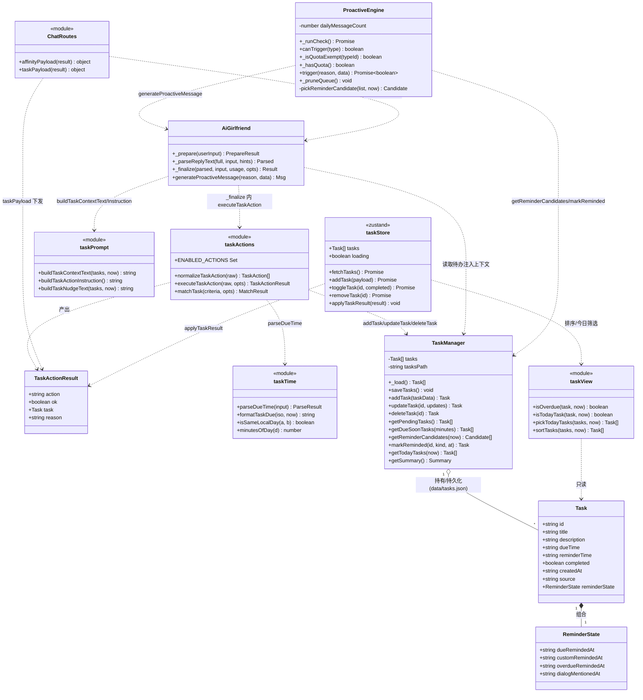
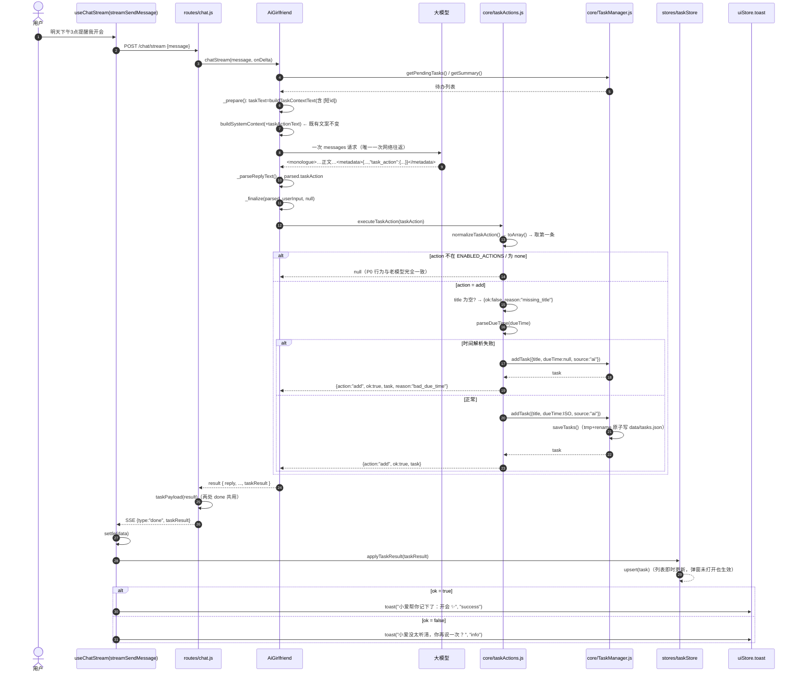
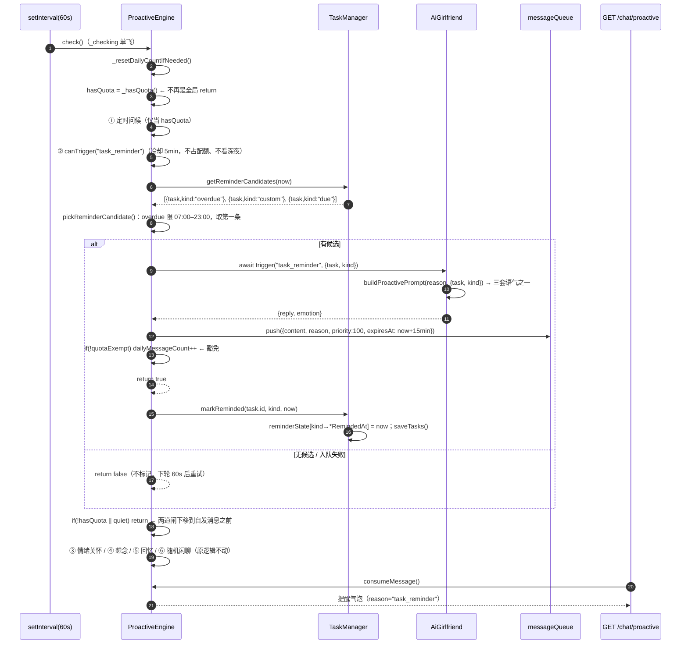
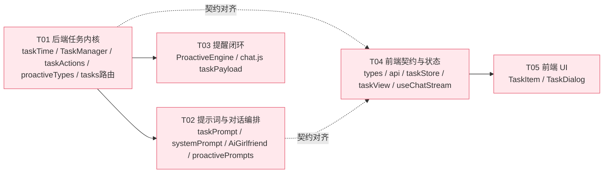

# 增量架构设计：小爱任务清单系统重构

> 作者：高见远（架构师） ｜ 输入：`docs/tasks-refactor/prd.md`（许清楚）
> 范围：**增量改造**既有「小爱 AI 女友」项目，不新建工程、不换技术栈。
> 路径约定：本文所有相对路径中，`backend-node/` = Node 后端根目录，`frontend/` = Next.js 前端根目录。

---

## 0. 设计基线与硬约束（本次改造的边界）

| # | 约束 | 落地方式 |
|---|------|----------|
| C1 | `PERSONA_SYSTEM_PROMPT` 既有文案**逐行保留** | 只改 `buildSystemContext()` 的参数与拼接，不动模板字符串既有行；新增段落走**新参数**注入 |
| C2 | 一次对话只允许**一次**阻塞网络往返 | task 意图识别复用**本次 LLM 返回**的 metadata，绝不新增第二次调用 |
| C3 | `/chat` 与 `/chat/stream` 行为一致 | 新增 `taskPayload(result)` helper，与 `affinityPayload(result)` 平级，两处 done 共用 |
| C4 | metadata 新增字段向后兼容 | `task_action` 缺失/解析失败 → 行为完全不变（`taskResult: null`） |
| C5 | 后端统一走 `dataPath/jsonStore`，异步 `asyncHandler`，校验 `fail()` | 新逻辑落 `core/*.js`，不新增路由（除既有 `/tasks` 系列字段追加） |
| C6 | 前端不用 persist；React 19 Compiler lint 零容忍 | `taskStore` 纯内存 zustand；时间相关一律「effect 里 setState」，render 期间不调 `Date.now()` |
| C7 | UI 防抽动 | 进度块/提醒区预留固定高度（`min-h-*`），滚动容器加 `[scrollbar-gutter:stable]` |

---

## 1. 实现方案与关键权衡

### 1.1 四个技术难点与选型

| 难点 | 方案 | 为什么不用别的 |
|------|------|----------------|
| **① 意图识别不能新增 LLM 调用** | 在**既有 `<metadata>` JSON 内部**追加 `task_action`。指令写在 `buildSystemContext()` 的 `[Response Instructions]` 第 3 条之后（新增第 4 条），模型同一次输出里顺带回传 | 新开 XML 标签要改 `core/streamFilter.js` 状态机 + 三条解析路径（`_parseReplyText` / `generateProactiveMessage` / streamFilter.finish），风险高且流式截断会漏 |
| **② LLM 给的时间五花八门** | 新增 `core/taskTime.js`：**自写正则解析**，不依赖 `Date` 字符串解析的引擎差异；失败则丢弃时间、保留任务、回 `reason:"bad_due_time"` | 不引 `chrono-node`/`dayjs`：一个正则文件能覆盖 ISO / `YYYY-MM-DD HH:mm` / `YYYY/MM/DD HH:mm` / 带不带时区，无需新增依赖 |
| **③ 提醒「只说一次」且「该说的一定会说」** | 去重状态放 `Task.reminderState`（随任务落盘），`task_reminder` 冷却从 30min 降到 **5min**，并新增 **`quotaExempt: true`** 让它不吃每日配额 | 用 `lastTriggerByType` 冷却做去重（现状）必然误伤：两条不同任务会互相压制；去重必须绑定**任务 × 提醒类型** |
| **④ AI 建单时弹窗通常没打开** | 新增 `stores/taskStore.ts`（无 persist），AI 结果经 `applyTaskResult()` 直接进 store，弹窗打开即显示 | 组件内 `useState`（现状）外部不可写；`persist` 与项目约定冲突 |

### 1.2 关键决策的具体落地方式

```
D1  task_action 放 metadata 内部      → AiGirlfriend._parseReplyText 读 metadata.task_action
D2  P0 单条 + 解析层 toArray()         → taskActions.normalizeTaskAction() 内部先 toArray 再取第一条（P1 放开数组只改一行）
D3  LLM 给绝对时间 + 后端宽容归一化    → taskPrompt 要求输出带时区 ISO；taskTime.parseDueTime() 兜底
D4  时间解析失败 → 保留任务 + reason   → ok:true + reason:"bad_due_time"（不是失败）
D5  去重放 Task.reminderState          → TaskManager.markReminded(id, kind, at)
D6  提醒不占每日配额                   → proactiveTypes.task_reminder.quotaExempt = true + _runCheck/trigger 改造（见 1.3）
D7  逾期提醒限 07:00–23:00             → OVERDUE_WINDOW 常量，只在 ProactiveEngine 选候选时过滤
D8  AI 删除 P1 开放                    → taskActions.ENABLED_ACTIONS 白名单，P0 = {add, none}
D9  新增 taskStore（无 persist）       → frontend/src/stores/taskStore.ts
D10 今日口径单点定义                   → frontend/src/lib/taskView.ts（纯函数）+ 后端 TaskManager.getTodayTasks 同口径
D11 addTask 入参白名单                 → TaskManager.TASK_WRITE_FIELDS
D12 taskPayload helper 两处共用        → routes/chat.js
```

### 1.3 ⭐ `quotaExempt` 的具体改法（本次最易踩坑处）

**现状问题**：`_runCheck()` 第 2 行就是 `if (this.dailyMessageCount >= this.getDailyLimit()) return;` —— 这是一道**全局闸**，配额打满后任务提醒（用户自己设的）也被一起挡住；`trigger()` 末尾 `this.dailyMessageCount++` 又会**反过来**把豁免消息计入配额，且 `_pruneQueue()` 的「退还配额」会把豁免消息也误退。

**改造分四步，缺一不可：**

**Step 1｜类型目录加字段**（`core/proactiveTypes.js`）

```js
{
    id: 'task_reminder',
    ...
    baseCooldown: 5 * MIN,      // 原 30 * MIN：去重已交给 reminderState，冷却只用来防刷屏
    ttl: 15 * MIN,
    quietExempt: true,
    quotaExempt: true,          // ← 新增：不占每日主动消息配额
    defaultEnabled: true,
}
```
并在 `FALLBACK_TYPE` 补 `quotaExempt: false`（未知类型按「占配额」处理，保守）。
> `toPublicTypeInfo()` 只挑 `id/label/labelZh/description/schedule/icon/group/defaultEnabled`，**不会**把 `quotaExempt` 泄漏给前端，无需改路由。

**Step 2｜新增两个判定 helper**（`core/ProactiveEngine.js`）

```js
_isQuotaExempt(typeId) { return !!getProactiveType(typeId)?.quotaExempt; }
_hasQuota() { return this.dailyMessageCount < this.getDailyLimit(); }
```

**Step 3｜`_runCheck()` 把「全局闸」拆成「按类型闸」**

改动要点：① 原第 2 行 `return` 删掉，改为算出 `const hasQuota = this._hasQuota();`；② ① 定时问候块用 `if (hasQuota) { ... }` 包住；③ ② 任务提醒块**不看 hasQuota**，且必须在 `if (quiet) return;` **之前**（任务提醒不受深夜免打扰限制，这是既有语义）；④ 原来那两道闸移到 ② 之后、③ 之前，合并成 `if (!hasQuota || quiet) return;`。

```js
async _runCheck() {
    this._resetDailyCountIfNeeded();
    const hasQuota = this._hasQuota();                 // ← 不再是 return，而是一个标志
    const now = new Date();
    const nowMinutes = minutesOfDay(now);
    const quiet = this.isQuietHours(now);

    // ① 定时问候：时间窗内每天一次（占配额）
    if (hasQuota) {
        for (const type of PROACTIVE_TYPES) { /* ...原逻辑不变... */ }
    }

    // ② 任务提醒：quotaExempt —— 不看 hasQuota，也不看 quiet
    if (this.canTrigger('task_reminder')) {
        const hit = pickReminderCandidate(TaskManager.getReminderCandidates(now), now);
        if (hit) {
            const ok = await this.trigger('task_reminder', { task: hit.task, kind: hit.kind });
            if (ok) TaskManager.markReminded(hit.task.id, hit.kind, now.toISOString());
            return;
        }
    }

    // 两道闸下移：以下都是「自发」消息，占配额且深夜不打扰
    if (!hasQuota || quiet) return;

    // ③ 情绪关怀 / ④ 想念 / ⑤ 回忆 / ⑥ 随机闲聊 —— 原逻辑逐字不动
}
```

> ⚠️ 唯一的行为变化：`trigger()` 现在**返回 boolean**（成功入队 `true`），且 ② 处必须 `await`（原来 `return this.trigger(...)` 是 fire-and-forget，拿不到入队结果就没法安全 `markReminded`）。`check()` 已有 `_checking` 单飞保护，await 不会叠加并发。

**Step 4｜`trigger()` 与 `_pruneQueue()` 同步豁免**

```js
// trigger() 内，入队成功后：
this.lastTriggerTime = Date.now();
this.lastTriggerByType[reason] = Date.now();
if (!type.quotaExempt) this.dailyMessageCount++;      // ← 豁免类型不计数
if (type.dailyOnce) this.sentDays[reason] = dayKey();
```
```js
// _pruneQueue() 内，丢弃过期消息时：
for (const m of this.messageQueue) {
    if (m.expiresAt && m.expiresAt <= now) {
        if (!this._isQuotaExempt(m.reason)) {          // ← 豁免类型没占过配额，不能退
            this.dailyMessageCount = Math.max(0, this.dailyMessageCount - 1);
        }
        console.log(`[ProactiveEngine] Dropped expired message: ${m.reason} (ttl exceeded)`);
    } else { kept.push(m); }
}
```
```js
// 早退路径统一返回 false，成功返回 true（三处 early return 都要改）
if (this._inflight.has(type.id)) return false;
if (this.messageQueue.length >= this.maxQueueSize) return false;
if (!message || !message.reply) return false;
// ... 入队成功后 return true;  catch 里 return false;
```

**验收自测**：把 `customDailyLimit` 设成 0 → 配额瞬间打满 → 手动 `POST /chat/proactive/trigger`（占配额，应不发）/ 直接造一个 15 分钟内到期的任务 → 60s 内仍应收到 `task_reminder`；两条不同任务可在 5min 内各提醒一次（冷却 5min，去重靠 reminderState）。

### 1.4 提醒候选的选取（P0-6 / P0-7 / P1-1）

```js
// core/TaskManager.js 顶部导出（全项目唯一真源）
export const REMINDER_KIND  = { due: 'due', custom: 'custom', overdue: 'overdue', dialog: 'dialog' };
export const REMINDER_FIELD = { due: 'dueRemindedAt', custom: 'customRemindedAt',
                                overdue: 'overdueRemindedAt', dialog: 'dialogMentionedAt' };
export const DUE_SOON_MINUTES      = 15;      // 到期前提醒窗口
export const CUSTOM_WINDOW_MINUTES = 15;      // reminderTime 命中窗口 (now-15min, now+15min]
export const OVERDUE_GRACE_MS      = 60_000;  // due <= now-1min 才算逾期（避免刚到点就报逾期）
export const OVERDUE_WINDOW        = { from: 7 * 60, to: 23 * 60 };  // 逾期提醒只在 07:00–23:00 入队
```

`getReminderCandidates(now)` 返回一个**已排序**的数组 `[{ task, kind }]`，排序：`overdue(0) > custom(1) > due(2)`，同 kind 内按时间早的优先。过滤条件：

| kind | 命中条件 | 去重标记 |
|------|----------|----------|
| `overdue` | `!completed && dueTime && due <= now - 1min` | `!reminderState.overdueRemindedAt` |
| `custom` | `!completed && reminderTime && reminderTime > now-15min && reminderTime <= now+15min` | `!reminderState.customRemindedAt` |
| `due` | `!completed && dueTime && due > now && due <= now + 15min` | `!reminderState.dueRemindedAt` |

`ProactiveEngine.pickReminderCandidate()`（模块内私有函数）取**第一条**，但对 `overdue` 额外做时段过滤：不在 `OVERDUE_WINDOW` 内则跳过该条看下一个（due/custom 全天）。**入队成功才 `markReminded`**，失败（LLM 挂了/队列满）不标记，下轮重试。

---

## 2. 完整文件清单

### 2.1 后端 `backend-node/`

| # | 相对路径 | 性质 | 一句话说明 |
|---|----------|------|-----------|
| B1 | `src/core/taskTime.js` | **新增** | 时间归一化与格式化：`parseDueTime()` / `formatTaskDue()` / `startOfLocalDay()` / `isSameLocalDay()` / `minutesOfDay()` |
| B2 | `src/core/taskActions.js` | **新增** | `task_action` 执行器：`normalizeTaskAction()`（toArray 归一化）、`executeTaskAction()`、`matchTask()`；内置 `ENABLED_ACTIONS` 白名单（P0 只开 add） |
| B3 | `src/core/prompts/taskPrompt.js` | **新增** | 三段注入文本：`buildTaskContextText()`（P0-2 任务上下文，含 `[短id]`）、`buildTaskActionInstruction()`（P0-1 正/反向清单）、`buildTaskNudgeText()`（P1-2 对话内软提醒） |
| B4 | `src/core/TaskManager.js` | **修改** | 白名单 `addTask` + `_load()` 幂等归一化迁移 + `getReminderCandidates()` / `markReminded()` / `getTodayTasks()` + 常量导出 + 关键动作日志 |
| B5 | `src/core/ProactiveEngine.js` | **修改** | quotaExempt 四步改造（见 1.3）+ 步骤②改用 `getReminderCandidates` + `pickReminderCandidate`（含 overdue 时段过滤）+ `trigger()` 返 boolean |
| B6 | `src/core/proactiveTypes.js` | **修改** | `task_reminder.baseCooldown` 30min→5min、新增 `quotaExempt: true`；`FALLBACK_TYPE` 补 `quotaExempt: false` |
| B7 | `src/core/AiGirlfriend.js` | **修改** | `_prepare()` 用新 taskText + 注入 `taskActionText`（及 P1 `taskNudgeText`）；`_parseReplyText()` 解析 `task_action`；`_finalize()` 同步执行并产出 `taskResult` |
| B8 | `src/core/prompts/systemPrompt.js` | **修改** | `buildSystemContext()` 新增可选参数 `taskActionText` / `taskNudgeText`，在第 3 条 Metadata 之后插入；**既有模板行一字不改** |
| B9 | `src/core/prompts/proactivePrompts.js` | **修改** | `task_reminder` 分支改为 `kind` 三套语气（due / custom / overdue） |
| B10 | `src/routes/chat.js` | **修改** | 新增 `taskPayload(result)` helper，`/chat` 与 `/chat/stream` done 两处共用展开 |
| B11 | `src/routes/tasks.js` | **修改** | `GET /tasks/summary` 追加 `today:{total,completed}`（P1-6）；其余不动 |

**不改动**：`src/core/streamFilter.js`（metadata 捕获已够用）、`src/routes/configRoutes.js`（`toPublicTypeInfo` 不泄漏新字段）、`src/app.js`（无新路由）、好感度/情绪/记忆链路全部文件。

### 2.2 前端 `frontend/`

| # | 相对路径 | 性质 | 一句话说明 |
|---|----------|------|-----------|
| F1 | `src/stores/taskStore.ts` | **新增** | zustand（**无 persist**）持有 tasks，含 `applyTaskResult()` |
| F2 | `src/lib/taskView.ts` | **新增** | 纯函数：`isOverdue()` / `isTodayTask()` / `pickTodayTasks()` / `sortTasks()` —— 今日口径与排序单点定义 |
| F3 | `src/components/dialogs/TaskItem.tsx` | **新增** | 单条任务行（逾期角标、AI 来源 ✨、时间行），从 TaskDialog 抽出的业务子组件 |
| F4 | `src/types/index.ts` | **修改** | `Task` 追加 `source` / `reminderState`；新增 `TaskActionResult`；`ChatResponse` 追加 `taskResult` |
| F5 | `src/lib/api.ts` | **修改** | `/chat/stream` done 解析追加 `taskResult` 映射（约 222 行 `final = {...}` 内） |
| F6 | `src/hooks/useChatStream.ts` | **修改** | `settle()` 内 `applyTaskResult()` + 成功/失败 toast |
| F7 | `src/components/dialogs/TaskDialog.tsx` | **修改** | 改为消费 taskStore；今日进度语义修正；逾期标记与排序；滚动容器 `[scrollbar-gutter:stable]` |
| F8 | `src/components/chat/ChatInput.tsx` | **修改（P2，可选）** | placeholder 提示自然语言用法 |

---

## 3. 数据结构与接口

### 3.1 `Task` 实体（纯追加，老数据由 `_load()` 补齐）

```ts
interface Task {
  id: string;
  title: string;
  description?: string;
  dueTime?: string | null;
  reminderTime?: string | null;
  completed: boolean;
  createdAt?: string;
  source: "manual" | "ai";            // 新增，默认 "manual"
  reminderState: ReminderState;       // 新增，默认 {}
}

interface ReminderState {
  dueRemindedAt?: string;       // 到期前提醒已发（kind=due）
  customRemindedAt?: string;    // reminderTime 提醒已发（kind=custom）
  overdueRemindedAt?: string;   // 逾期提醒已发（kind=overdue）
  dialogMentionedAt?: string;   // 对话内提及时间（kind=dialog，P1 24h 防抖）
}
```
**迁移**：`TaskManager._load()` 后逐条 `normalizeTask()`（补字段、清洗 `reminderState` 非对象 → `{}`），**仅当有字段实际变化时才 `saveTasks()` 落盘一次**（避免每次启动无谓写盘）；幂等，重复启动不会再写。

### 3.2 `task_action` 契约（LLM → 后端）

```jsonc
<metadata>{
  "emotion": "开心",
  "affinity_change": 0,
  "emotion_delta": { "P": 0.1, "A": 0, "D": 0 },
  "task_action": {                                  // 可选，缺省 = none = 不执行写操作
    "action": "add",                                // "add" | "complete" | "delete" | "none"
    "title": "开会",                                 // add 必填；complete/delete 用于匹配
    "dueTime": "2026-10-01T15:00:00+08:00",          // ISO 8601 | null
    "taskId": "a1b2c3d4"                             // 可选，命中注入的短 id 时给出
  }
}</metadata>
```

| 字段 | 类型 | 说明 |
|------|------|------|
| `action` | `"add" \| "complete" \| "delete" \| "none"` | 缺省 = `none` = 不执行写操作 |
| `title` | string | `add` 必填；`complete`/`delete` 用于匹配 |
| `dueTime` | ISO 8601 \| null | LLM 直接给绝对时间，后端宽容归一化 |
| `taskId` | string \| undefined | 可选，命中注入的任务**短 id（uuid 前 8 位）**时给出 |

**P0 只启用 `add`**：`taskActions.ENABLED_ACTIONS = new Set(['add','none'])`；`complete`/`delete` 返回 `{action, ok:false, reason:'unknown_action'}`（P1 只需把两个 action 加进 Set 即可放开）。

### 3.3 `TaskActionResult` 契约（后端 → 前端，`/chat` 与 `/chat/stream` done）

```ts
interface TaskActionResult {
  action: "add" | "complete" | "delete" | "none";
  ok: boolean;
  task?: Task;
  reason?: "missing_title" | "bad_due_time" | "duplicate" | "not_found" | "ambiguous" | "unknown_action";
}
type ChatResponseTaskResult = TaskActionResult | null;   // 老模型无 task_action 时恒为 null
```

### 3.4 API 变更一览

| 端点 | 变更 | 说明 |
|------|------|------|
| `POST /chat` | 响应体追加 `taskResult` | 经 `taskPayload(result)` |
| `POST /chat/stream` | `done` 事件追加 `taskResult` | 同一个 helper，行为一致（C3） |
| `GET /tasks` | 任务对象追加 `source` / `reminderState` | 全量下发（决策：不做裁剪） |
| `POST /tasks` | 无契约变更 | 入参白名单在 TaskManager 内收敛 |
| `PUT /tasks/:id` | 无契约变更 | 同上，`id/createdAt` 永不被覆盖 |
| `GET /tasks/summary` | 追加 `today: { total, completed }` | P1-6，纯字段追加 |
| `GET /tasks/due` | 不变 | 保留给旧调用方，引擎不再使用 |

### 3.5 核心模块签名

```js
// ---------- B1 core/taskTime.js ----------
/** @returns {{ok:boolean, iso?:string, error?:'empty'|'unparseable'|'invalid'}} */
export function parseDueTime(input);
export function formatTaskDue(iso, now = new Date());   // "今日 18:00" | "明天 09:00" | "10月1日 15:00" | "无时间"
export function startOfLocalDay(d), endOfLocalDay(d), isSameLocalDay(a, b, now?), minutesOfDay(d);

// ---------- B2 core/taskActions.js ----------
export function normalizeTaskAction(raw);   // toArray()：对象→[obj]；数组→过滤后的对象数组；其余→[]
export function executeTaskAction(raw, { now = new Date() } = {});  // → TaskActionResult | null
export function matchTask({ taskId, title }, { now });  // → {ok:true,task} | {ok:false,reason:'not_found'|'ambiguous'}

// ---------- B4 core/TaskManager.js ----------
export const TASK_WRITE_FIELDS;   // ['title','description','dueTime','reminderTime','completed','source']
class TaskManager {
  addTask(taskData)               // 白名单 + id/createdAt/reminderState 不可覆盖
  updateTask(id, updates)         // 同上白名单，id/createdAt 剔除
  getReminderCandidates(now)      // → [{ task, kind }]，已排序 overdue>custom>due
  markReminded(id, kind, at)      // kind ∈ REMINDER_KIND，写 reminderState + saveTasks
  getTodayTasks(now)              // 今日口径：dueTime 在今天 或 (无 dueTime 且 createdAt 在今天)
  getSummary()                    // { total, completed, pending, today:{total,completed} }
}

// ---------- B3 core/prompts/taskPrompt.js ----------
export function buildTaskContextText(tasks, now = new Date());   // 最多 5 条，含 [短id] 与「已逾期」/「1 小时内到期」标注
export function buildTaskActionInstruction();                    // [Response Instructions] 第 4 条
export function buildTaskNudgeText(tasks, now);                  // P1-2 软提醒指令（无候选时返回 ''）
```

### 3.6 类图



---

## 4. 程序调用流程

### 4.1 用户说「明天下午3点提醒我开会」→ 建单 → toast



### 4.2 提醒链路 `check()` → `getReminderCandidates()` → `trigger()` → `markReminded()`



---

## 5. 任务列表（有序，工程师照此实现）

> 每个任务分两段：**【P0】必做**（本次上线范围）与 **【P1】同批**（成本极低、建议一起做完；时间紧可延后，不影响 P0 验收）。
> 门禁：后端 `npm run check`（`scripts/check-syntax.mjs`）；前端 `npx tsc --noEmit` + `npx eslint src`。每个任务结束都要跑通。

### T01 — 后端任务内核（时间归一化 + TaskManager + 执行器 + 类型目录）

**优先级**：P0 ｜ **依赖**：无 ｜ **文件**：B1 新增、B2 新增、B4 修改、B6 修改、B11 修改

- 【P0】`src/core/taskTime.js`（新）：`parseDueTime()` 支持 ISO（带/不带时区）、`YYYY-MM-DD HH:mm`、`YYYY/MM/DD HH:mm`（`-` 与 `/` 混用也收）、可选秒；**无时区按本机时区**解释；纯日期补默认时间（见 §8-Q1）；`formatTaskDue()` / `startOfLocalDay()` / `isSameLocalDay()` / `minutesOfDay()`。禁止 `new Date(str)` 直接兜底。
- 【P0】`src/core/TaskManager.js`（改）：
  - 导出 `TASK_WRITE_FIELDS` / `REMINDER_KIND` / `REMINDER_FIELD` / `DUE_SOON_MINUTES` / `CUSTOM_WINDOW_MINUTES` / `OVERDUE_GRACE_MS` / `OVERDUE_WINDOW`；
  - `_load()` → `normalizeTask()` 幂等迁移（补 `source` / `reminderState`，dirty 才写盘）；
  - `addTask()`：先展开**白名单后的** `taskData`，再覆盖 `id` / `createdAt` / `reminderState`，`completed`/`source` 归一化（**修复痛点 6**）；`updateTask()` 同样剔除 `id` / `createdAt`；
  - `getReminderCandidates(now)`（三类 + 排序 + 去重过滤）、`markReminded(id, kind, at)`、`getTodayTasks(now)`；
  - `getDueSoonTasks()` 保留不动（`/tasks/due` 仍用它）。
- 【P0】`src/core/taskActions.js`（新）：`normalizeTaskAction()`（**toArray() 归一化**）、`executeTaskAction()`（`ENABLED_ACTIONS = {'add','none'}`）、`matchTask()`（taskId 用 `id.startsWith(taskId)` 且长度 ≥ 4；否则 title 模糊，0 命中→`not_found`，多命中→`ambiguous`）。
- 【P0】`src/core/proactiveTypes.js`（改）：`task_reminder.baseCooldown: 5*MIN`、`quotaExempt: true`；`FALLBACK_TYPE.quotaExempt: false`。
- 【P1】`src/routes/tasks.js`：`GET /tasks/summary` 追加 `today:{total,completed}`（P1-6）；TaskManager 关键动作打日志（P1-7）。

**验收**：造一条 `dueTime="2026-10-01 15:00"`、`reminderTime` 存在的任务 → `getReminderCandidates()` 三类分别能被选中；`addTask({id:'x', completed:true, source:'ai'})` 后 `id` 仍是新 uuid 且 `completed===false`；老 `tasks.json`（无新字段）启动后字段被补齐且只写盘一次。

### T02 — 提示词与对话编排（意图识别 + 上下文注入 + 解析执行）

**优先级**：P0 ｜ **依赖**：T01 ｜ **文件**：B3 新增、B8 修改、B7 修改、B9 修改

- 【P0】`src/core/prompts/taskPrompt.js`（新）：
  - `buildTaskContextText(tasks, now)`：最多 5 条，格式 `[短id] 标题（10月1日 15:00 / 今日 18:00 / 无时间）`，**单独标出**「⚠️ 已逾期」「⏰ 1 小时内到期」（逾期优先占位）；
  - `buildTaskActionInstruction()`：`[Response Instructions]` 第 4 条英文指令，含**正向触发清单**与**反向禁止清单**（文案见 §7.2）。
- 【P0】`src/core/prompts/systemPrompt.js`（改）：`buildSystemContext()` 新增可选参数 `taskActionText`（默认 `''`），在「3. Metadata」段之后插入；**既有模板行一字不改**（C1）。
- 【P0】`src/core/AiGirlfriend.js`（改）：
  - `_prepare()`：`taskText` 改用 `buildTaskContextText()`，传入 `taskActionText`；
  - `_parseReplyText()`：metadata 解析成功时取 `metadata.task_action ?? null` → `parsed.taskAction`；
  - `_finalize()`：return 前 `try { taskResult = executeTaskAction(parsed.taskAction) } catch { taskResult = null }`，塞进返回对象。
- 【P0】`src/core/prompts/proactivePrompts.js`（改）：`task_reminder` 改 `buildTaskReminderPrompt(task, kind, level)` 三套语气（due / custom / overdue，默认回 due）。
- 【P1】`buildTaskNudgeText()` + `_prepare()` 注入软提醒、`_finalize(parsed, input, usage, { nudgeTaskIds })` 里 `markReminded(id,'dialog')`（24h 防抖，P1-2）。

**验收**：「明天下午3点提醒我开会」→ 建单成功且 `dueTime` 正确；「我今天开了个会」「任务好多啊」「你上次提醒我的事」→ `task_action` 为 `none` 或缺失、**不建单**；`diff` 检查 `PERSONA_SYSTEM_PROMPT` 零改动。

### T03 — 提醒闭环（ProactiveEngine 配额/冷却/候选 + 路由下发）

**优先级**：P0 ｜ **依赖**：T01（常量与候选 API） ｜ **文件**：B5 修改、B10 修改

- 【P0】`src/core/ProactiveEngine.js`（改）：严格按 §1.3 的**四步**执行 —— ① `_isQuotaExempt()` / `_hasQuota()` helper；② `_runCheck()` 全局闸改标志位、`if (hasQuota)` 包住①、任务提醒块上移到 `quiet` 判断之前、`if (!hasQuota || quiet) return;` 下移；③ `trigger()` 三处 early return 改 `return false`、成功 `return true`、`dailyMessageCount++` 加 `if (!type.quotaExempt)`；④ `_pruneQueue()` 退还配额加 `if (!_isQuotaExempt(m.reason))`。
- 【P0】步骤②改为消费 `TaskManager.getReminderCandidates(now)` + 私有 `pickReminderCandidate()`（overdue 限 `OVERDUE_WINDOW`），`await trigger(...)` 成功后 `markReminded(id, kind)`。
- 【P0】`src/routes/chat.js`（改）：新增 `taskPayload(result)`（`{ taskResult: result.taskResult ?? null }`），`/chat` 与 `/chat/stream` 的 done **两处都展开**（C3）。
- 【P1】`reminderTime` 命中即发（P1-1，窗口常量已在 T01，本任务只需确认候选带上 kind=custom）；`buildProactivePrompt` 收 `kind`。

**验收**：同一任务同一类提醒全生命周期只触发一次；重启后端后不重复提醒；`customDailyLimit=0` 时任务提醒仍能发出；两条不同任务 5min 内各提醒一次；`/chat` 与 `/chat/stream` 返回的 `taskResult` 字段完全一致。

### T04 — 前端契约与状态（类型 + api + taskStore + 纯函数 + 发送管线）

**优先级**：P0 ｜ **依赖**：T01（契约对齐即可，代码可并行） ｜ **文件**：F4、F5、F1 新增、F2 新增、F6 修改

- 【P0】`src/types/index.ts`：`Task` 追加 `source` / `reminderState`（+ `ReminderState` 接口）；新增 `TaskActionResult`；`ChatResponse` 追加 `taskResult?: TaskActionResult | null`。
- 【P0】`src/lib/api.ts`：`/chat/stream` done 解析的 `final = {...}` 内追加 `taskResult: payload.taskResult ?? null`（约 222 行）。
- 【P0】`src/stores/taskStore.ts`（新）：zustand **无 persist**；`tasks` / `loading` / `fetchTasks` / `addTask` / `toggleTask` / `removeTask` / `applyTaskResult`；`applyTaskResult` 语义：`add|complete` + ok + task → upsert，`delete` + ok + task → remove，其余不动。所有网络回调在 Promise 内 `set`（C6）。
- 【P0】`src/lib/taskView.ts`（新）：`isOverdue(task, now)`（`!completed && dueTime && due < now`）、`isTodayTask(task, now)`（今日口径）、`pickTodayTasks()`、`sortTasks()`（逾期 → 有到期时间升序 → 无到期时间 → 已完成）。
- 【P0】`src/hooks/useChatStream.ts`：`settle()` 内 `applyTaskResult(data.taskResult)`；`ok` → `toast(\`小爱帮你记下了：${title} ✨\`, "success")`（`reason==='bad_due_time'` 时文案追加「（时间没听清，先不设提醒）」）；`!ok` → `toast("小爱没太听清，你再说一次？", "info")`；`null` 不提示。

**验收**：AI 建单后不开弹窗，`taskStore.tasks` 已含新任务；打开弹窗立即可见；toast 类型正确。

### T05 — 前端 UI（TaskDialog 改造 + 逾期标记 + 今日进度）

**优先级**：P0 ｜ **依赖**：T04 ｜ **文件**：F3 新增、F7 修改（F8 可选）

- 【P0】`src/components/dialogs/TaskItem.tsx`（新）：单条任务行，逾期 → 时间行 `text-status-danger` + 「已逾期」角标；时间用 `formatTaskDue` 同款紧凑格式（本地时区）。
- 【P0】`src/components/dialogs/TaskDialog.tsx`（改）：
  - 组件内 `useState<Task[]>` **删除**，改为消费 `useTaskStore()`；手动增删改走 store action；
  - 列表按 `sortTasks(tasks, now)` 渲染；
  - **今日进度语义修正**：只统计 `pickTodayTasks()`；`total === 0` 时整块隐藏、改显示「另有 N 条待办」（N = 全部未完成数）；
  - 滚动容器加 `[scrollbar-gutter:stable]`，进度块容器给 `min-h-*` 预留高度（C7）；
  - 时间比较用 `const [nowTick, setNowTick] = useState(0)` + `useEffect` 内 `setInterval(60s)` 更新，**render 期间不调 `Date.now()`**（C6）。
- 【P1】AI 来源标记：卡片显示 ✨ + `title="小爱帮你记的"`（P1-3）。

**验收**：无今日任务时进度块隐藏并显示「另有 N 条待办」；逾期任务有红色时间行 + 角标且排在首位；`npx tsc --noEmit` 与 `npx eslint src` 零错误。

---

## 6. 依赖包

**新增：无。**

- 后端：时间解析自写正则（不引 `dayjs` / `date-fns` / `chrono-node`），`uuid@^9` 已在依赖中。
- 前端：`zustand@^5`、`lucide-react`、`framer-motion` 均已安装。

---

## 7. 共享知识（跨文件约定，工程师必读）

### 7.1 枚举与常量（唯一真源）

| 名称 | 取值 | 真源位置 |
|------|------|----------|
| `kind` | `"due"` \| `"custom"` \| `"overdue"` \| `"dialog"` | `TaskManager.REMINDER_KIND` |
| `reminderState` 字段映射 | due→`dueRemindedAt`；custom→`customRemindedAt`；overdue→`overdueRemindedAt`；dialog→`dialogMentionedAt` | `TaskManager.REMINDER_FIELD` |
| `reason` | `"missing_title"` \| `"bad_due_time"` \| `"duplicate"` \| `"not_found"` \| `"ambiguous"` \| `"unknown_action"` | `core/taskActions.js` |
| `source` | `"manual"`（默认）\| `"ai"` | `core/TaskManager.js` |
| 任务短 id | `task.id.slice(0, 8)`，注入 prompt 用；匹配时 `id.startsWith(taskId)` 且 `taskId.length >= 4` | `core/prompts/taskPrompt.js` |
| 今日口径 | `dueTime` 落在本地自然日 **或**（无 `dueTime` 且 `createdAt` 落在本地自然日） | 前端 `lib/taskView.ts` / 后端 `TaskManager.getTodayTasks` |
| 逾期判定 | `!completed && dueTime && due < now`（后端候选额外要求 `due <= now - 60s`） | `lib/taskView.ts` / `TaskManager.OVERDUE_GRACE_MS` |

### 7.2 `task_action` 指令文案（`buildTaskActionInstruction()` 直接取用）

```
4. **Task Action (optional)**:
   - If the user asks you to remember, remind, or schedule something, append a "task_action"
     object INSIDE the existing <metadata> JSON. Never create a new tag.
     <metadata>{"emotion":"开心","affinity_change":0,"task_action":{"action":"add","title":"开会","dueTime":"2026-10-01T15:00:00+08:00"}}</metadata>
   - action: "add" (create a to-do) or "none" (default; do nothing).
   - title: short noun phrase, no "提醒我" prefix ("开会", not "提醒我开会"). Required for "add".
   - dueTime: absolute ISO 8601 with timezone, resolved against [Current Time].
     Use null when no time was given. Never output relative words like "tomorrow".
   - DO use "add": 「明天下午3点提醒我开会」/「帮我记一下周五交周报」/「别忘了买牛奶」(imperative + future event).
   - DO NOT use "add" (must be "none"): past-tense narration (「我今天开了个会」), vague sighing
     (「任务好多啊」), recalling an old reminder (「你上次提醒我的事」), questions about the list
     (「我明天有什么安排」), your own suggestions, or anything the user did not ask you to record.
```

### 7.3 其他约定

- **后端**：所有持久化走 `dataPath()/readJson()/writeJson()`（tmp+rename 原子写）；新异步路由用 `asyncHandler`；入参校验用 `fail(res, cond, detail)`。
- **时间**：内部一律 ISO 8601 字符串存储；展示一律本地时区；不要在后端缓存 `new Date()`。
- **前端**：store 无 persist；轻提示一律 `toast(msg, type)`（`stores/uiStore`）；动效走 `tokens.css` 的 `--duration-fast/normal/slow`；通用原语只进 `components/ui/`，业务子组件留在对应业务目录。
- **日志前缀**：`[TaskManager]`、`[taskActions]`、`[ProactiveEngine]`，便于 grep 排查。

---

## 8. 待明确事项（已给默认，按默认实现即可；有异见请提）

| # | 问题 | 默认执行 |
|---|------|----------|
| Q1 | LLM 只给日期、不给时间（「10月1日开会」）时补几点？ | 补本地 **23:59**（视为「当天结束前」）；常量 `DEFAULT_DATE_TIME`，一行可调 |
| Q2 | `dialogMentionedAt` 如何判定「小爱真的提了」？ | **近似判定**：只要本轮注入了软提醒文本且非 ghosting 路径，就在 `_finalize` 标记（P1-2）。无法精确识别语义，接受近似 |
| Q3 | 逾期提醒限 07:00–23:00，`custom`（用户自设提醒）是否也限？ | **不限**：只有 `overdue` 受时段限制（D7） |
| Q4 | 同一任务既命中 `custom` 又命中 `due`（reminderTime 接近 dueTime）会提醒两次吗？ | **会**（两类各有独立标记，符合「一类一次」语义） |
| Q5 | `POST /tasks`（手动建单）允许外部传 `completed: true` 吗？ | 允许（白名单含 `completed`），但强转布尔；`source` 只认 `'ai'`，其余一律 `'manual'` |
| Q6 | 老 `tasks.json` 归一化后是否立即写盘？ | **仅当字段实际缺失时写一次**（dirty 检测），避免每次启动写盘 |
| Q7 | P2「同名未完成重复检测」（`reason:"duplicate"`）何时做？ | 本次**不做**；`taskActions` 预留 `duplicate` reason 与插入点 |
| Q8 | P0 是否要支持 `complete`/`delete`？ | **不**。P0 的 ENABLED_ACTIONS 只开 `add`；模型被指令约束不会输出另两者；P1 放开只需改 Set |

---

## 9. 任务依赖图



> 实现方式：T01 → T02/T03 → T04 → T05 为建议顺序；T04 与 T02/T03 无代码耦合（只共享契约字段），可并行。
